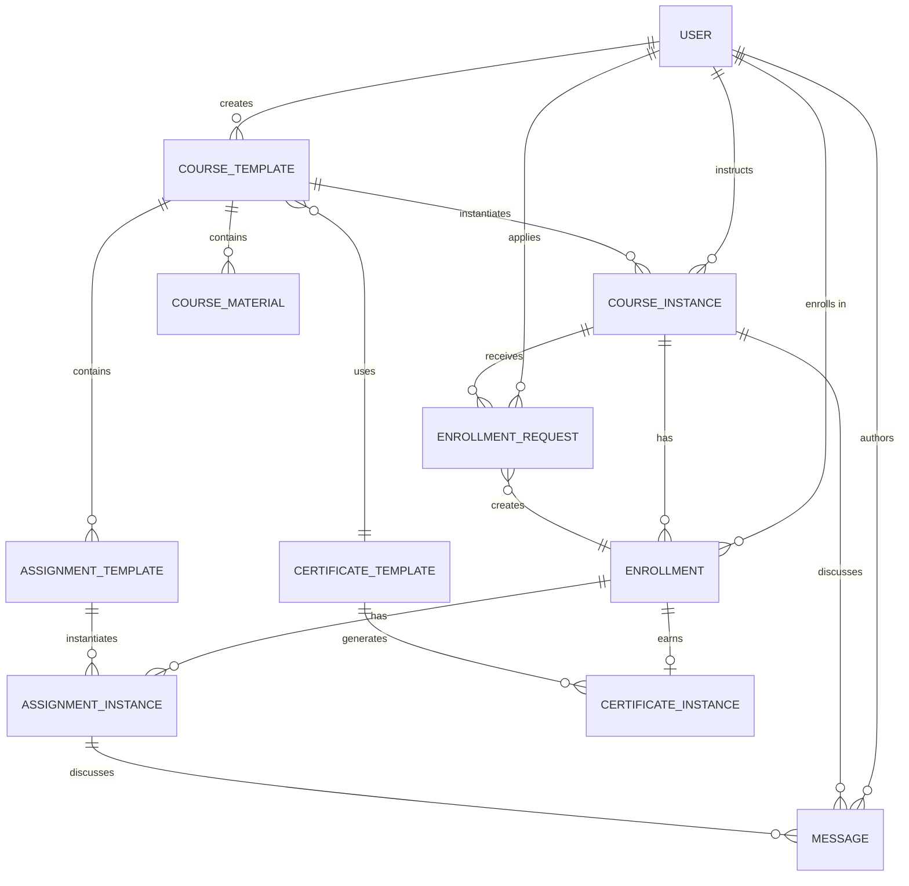
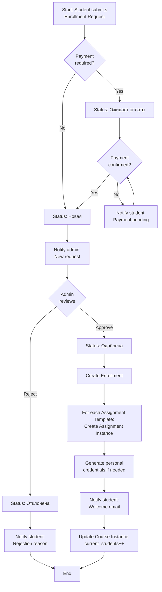
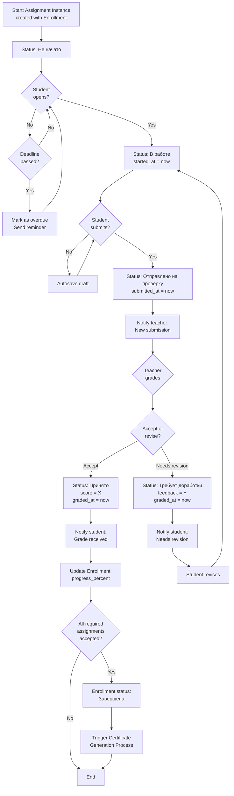
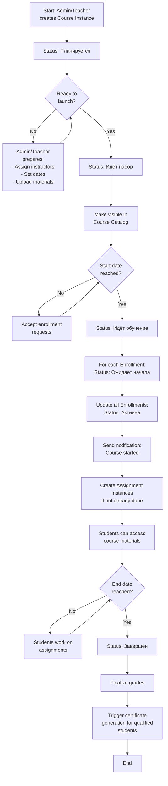

# Design Document v1: B3 Learning Portal

## Document Information

- **Version**: 1.0
- **Date**: 2025-12-09
- **Status**: Initial Design
- **Purpose**: Detailed design specification for B3 Learning Portal implementation

---

## Table of Contents

1. [Enhanced Data Model](#1-enhanced-data-model)
2. [UI/UX Design Improvements](#2-uiux-design-improvements)
3. [New Features to Add](#3-new-features-to-add)
4. [Color Scheme and Styling](#4-color-scheme-and-styling)
5. [BPMN Process Designs](#5-bpmn-process-designs)
6. [Technical Architecture](#6-technical-architecture)

---

## 1. Enhanced Data Model

### 1.1 Entity Classification

B3 platform uses two primary entity types:
- **Справочник (Reference/Directory)**: Master data, templates, relatively static
- **Документ (Document)**: Transactional data, instances, frequently changing

### 1.2 Core Entities

#### 1.2.1 Пользователь (User)
**Type**: Extends B3 platform User model
**Classification**: Справочник

**Fields**:
- `id` (UUID, auto): Primary key
- `username` (String, required): Login name
- `email` (String, required, unique): Email address
- `first_name` (String): First name
- `last_name` (String): Last name
- `patronymic` (String): Middle name (для РФ)
- `phone` (String): Contact phone
- `organization` (String): Company/organization name
- `position` (String): Job title
- `department` (String): Department/division
- `avatar` (File): Profile photo
- `bio` (Text): Short biography
- `date_joined` (DateTime, auto): Registration date
- `is_active` (Boolean, default=true): Account status
- `roles` (Many-to-Many → Role): Assigned roles

**Relationships**:
- Many-to-Many with Role (through Cabinet membership)

**Validators**:
- Email format validation
- Phone format validation (optional)

**Permissions**:
- Self: Read/Write own profile
- Admin: Read/Write all profiles

---

#### 1.2.2 Шаблон курса (Course Template)
**Type**: Справочник
**Description**: Master definition of a course (reusable across cohorts)

**Fields**:
- `id` (UUID, auto): Primary key
- `code` (String, required, unique): Course code (e.g., "B3-101")
- `title` (String, required): Course title
- `short_description` (String, 200 chars): Brief summary
- `full_description` (RichText): Detailed description with formatting
- `level` (Choice, required): Базовый | Продвинутый | Экспертный
- `category` (Choice): Разработка | Администрирование | Интеграция | Аналитика
- `duration_hours` (Integer): Estimated hours to complete
- `language` (Choice, default='ru'): ru | en
- `cover_image` (File): Course thumbnail image
- `prerequisites_text` (Text): Required prior knowledge
- `learning_objectives` (RichText): What students will learn
- `target_audience` (Text): Who should take this course
- `status` (Choice): Черновик | Активен | Архивирован
- `created_by` (FK → User): Course author
- `created_at` (DateTime, auto): Creation timestamp
- `updated_at` (DateTime, auto): Last modification
- `passing_score_percent` (Integer, default=70): Minimum % to pass
- `certificate_template` (FK → Certificate Template): Which cert to issue

**Relationships**:
- One-to-Many with Assignment Template (assignments in this course)
- One-to-Many with Course Instance (cohorts/streams)
- Many-to-One with User (creator)
- Many-to-One with Certificate Template

**Validators**:
- `passing_score_percent`: 0-100 range
- `code`: Alphanumeric + dash only

**Permissions**:
- Student: Read (if active)
- Teacher: Read/Write
- Admin: Full CRUD

---

#### 1.2.3 Шаблон задания (Assignment Template)
**Type**: Справочник
**Description**: Master definition of an assignment (part of Course Template)

**Fields**:
- `id` (UUID, auto): Primary key
- `course_template` (FK → Course Template, required): Parent course
- `order` (Integer, required): Sequence number (1, 2, 3...)
- `module_name` (String): Module/section name (e.g., "Модуль 1: Основы")
- `title` (String, required): Assignment title
- `type` (Choice, required): Лекция | Практика | Тест | Проект | Чтение
- `description` (RichText): Instructions and requirements
- `materials` (Files, multiple): Attached resources (PDFs, videos, etc.)
- `max_score` (Integer, required): Maximum points
- `is_required` (Boolean, default=true): Required for course completion
- `estimated_hours` (Decimal): Time estimate
- `due_days_after_start` (Integer, nullable): Days from course start (null = no deadline)
- `submission_type` (Choice): Текст | Файл | Ссылка | Без сдачи (для лекций)
- `rubric` (RichText): Grading criteria
- `created_at` (DateTime, auto)
- `updated_at` (DateTime, auto)

**Relationships**:
- Many-to-One with Course Template
- One-to-Many with Assignment Instance

**Validators**:
- `order`: Positive integer
- `max_score`: Positive integer
- `due_days_after_start`: Positive integer or null

**Permissions**:
- Student: Read (if course active)
- Teacher: Read/Write
- Admin: Full CRUD

---

#### 1.2.4 Экземпляр курса (Course Instance / Cohort)
**Type**: Документ
**Description**: Specific offering/stream of a course template

**Fields**:
- `id` (UUID, auto): Primary key
- `course_template` (FK → Course Template, required): Base course
- `cohort_name` (String, required): Display name (e.g., "Поток осень 2025")
- `start_date` (Date, required): Course start date
- `end_date` (Date, nullable): Course end date (can be open-ended)
- `instructors` (Many-to-Many → User): Lead teachers
- `status` (Choice): Планируется | Идёт набор | Идёт обучение | Завершён | Отменён
- `max_students` (Integer, nullable): Enrollment capacity
- `current_students` (Computed): Count of active enrollments
- `location` (String): Очно / Онлайн / Гибрид
- `notes` (Text): Internal notes for admins
- `created_at` (DateTime, auto)
- `updated_at` (DateTime, auto)

**Relationships**:
- Many-to-One with Course Template
- Many-to-Many with User (instructors)
- One-to-Many with Enrollment

**Computed Fields**:
- `current_students` = COUNT(Enrollment WHERE status = "Активна")
- `is_full` = current_students >= max_students
- `days_until_start` = start_date - today

**Validators**:
- `end_date` >= `start_date`
- `max_students` > 0

**Status Transitions** (BPMN):
- Планируется → Идёт набор (manual trigger)
- Идёт набор → Идёт обучение (on start_date or manual)
- Идёт обучение → Завершён (on end_date or manual)
- Any → Отменён (admin action)

**Permissions**:
- Student: Read (if status = "Идёт набор" or enrolled)
- Teacher: Read all, Write if assigned instructor
- Admin: Full CRUD

---

#### 1.2.5 Заявка на регистрацию (Enrollment Request)
**Type**: Документ
**Description**: Student application to join a course

**Fields**:
- `id` (UUID, auto): Primary key
- `student` (FK → User, required): Applicant
- `course_instance` (FK → Course Instance, required): Desired course
- `request_date` (DateTime, auto): Application timestamp
- `status` (Choice): Новая | На рассмотрении | Одобрена | Отклонена | Отозвана
- `motivation` (Text): Why student wants to take course (optional)
- `reviewed_by` (FK → User, nullable): Admin who processed request
- `reviewed_at` (DateTime, nullable): Decision timestamp
- `rejection_reason` (Text, nullable): Why request was denied
- `payment_status` (Choice, nullable): Не требуется | Ожидает оплаты | Оплачено (for paid courses)
- `payment_amount` (Decimal, nullable): Course fee
- `payment_receipt` (File, nullable): Payment confirmation

**Relationships**:
- Many-to-One with User (student)
- Many-to-One with Course Instance
- Many-to-One with User (reviewer)

**Status Transitions** (BPMN):
- Новая → На рассмотрении (auto or manual)
- На рассмотрении → [Одобрена | Отклонена] (admin decision)
- Одобрена → creates Enrollment automatically
- Any → Отозвана (student cancels)

**Permissions**:
- Student: Create own, Read own, Update (only if Новая)
- Admin: Read all, Update status

**Notifications**:
- Status change → notify student
- Новая request → notify admin

---

#### 1.2.6 Запись на курс (Enrollment)
**Type**: Документ
**Description**: Student's registration in a course instance

**Fields**:
- `id` (UUID, auto): Primary key
- `student` (FK → User, required): Enrolled student
- `course_instance` (FK → Course Instance, required): Course cohort
- `enrollment_date` (DateTime, auto): When enrolled
- `status` (Choice): Ожидает начала | Активна | Завершена | Отчислен
- `progress_percent` (Computed): % of assignments completed
- `total_score` (Computed): Sum of assignment scores
- `max_possible_score` (Computed): Sum of max_scores from templates
- `final_grade` (Decimal, nullable): Overall grade (0-100)
- `completion_date` (DateTime, nullable): When course was finished
- `certificate` (FK → Certificate Instance, nullable): Issued certificate
- `personal_sandbox_url` (String, nullable): Custom sandbox credentials
- `personal_notes` (Text): Student's private notes
- `instructor_notes` (Text): Teacher's private notes about student

**Relationships**:
- Many-to-One with User (student)
- Many-to-One with Course Instance
- One-to-Many with Assignment Instance
- One-to-One with Certificate Instance (nullable)

**Computed Fields**:
```python
progress_percent = (
    COUNT(Assignment Instance WHERE status='Принято') /
    COUNT(Assignment Template WHERE is_required=True)
) * 100

total_score = SUM(Assignment Instance.score)

max_possible_score = SUM(Assignment Template.max_score WHERE is_required=True)

final_grade = (total_score / max_possible_score) * 100 if max_possible_score > 0 else 0

is_passed = final_grade >= course_template.passing_score_percent
```

**Status Transitions**:
- Ожидает начала → Активна (when course starts)
- Активна → Завершена (when all required assignments completed AND final_grade >= passing_score)
- Активна → Отчислен (manual admin action or inactivity)

**Permissions**:
- Student: Read own enrollments, Update personal_notes
- Teacher: Read students in their courses, Update instructor_notes
- Admin: Full CRUD

**Notifications**:
- Enrollment created → notify student (welcome email)
- Status = Завершена → trigger certificate generation

---

#### 1.2.7 Экземпляр задания (Assignment Instance)
**Type**: Документ
**Description**: Student's work on a specific assignment

**Fields**:
- `id` (UUID, auto): Primary key
- `enrollment` (FK → Enrollment, required): Student's course enrollment
- `assignment_template` (FK → Assignment Template, required): What assignment this is
- `status` (Choice): Не начато | В работе | Отправлено на проверку | Принято | Требует доработки
- `created_at` (DateTime, auto): When assignment was instantiated
- `started_at` (DateTime, nullable): When student first opened it
- `submitted_at` (DateTime, nullable): When submitted for review
- `graded_at` (DateTime, nullable): When teacher graded
- `due_date` (Date, computed): Calculated from course start + template.due_days_after_start
- `submission_text` (RichText, nullable): Text answer (if type = Текст)
- `submission_files` (Files, multiple, nullable): Uploaded files (if type = Файл)
- `submission_url` (String, nullable): External link (if type = Ссылка)
- `score` (Integer, nullable): Points earned (0 to max_score)
- `feedback_text` (RichText, nullable): Teacher's comments
- `graded_by` (FK → User, nullable): Teacher who graded
- `attempt_number` (Integer, default=1): Resubmission count
- `time_spent_minutes` (Integer, default=0): Tracked time (future feature)

**Relationships**:
- Many-to-One with Enrollment
- Many-to-One with Assignment Template
- Many-to-One with User (grader)
- One-to-Many with Message (comments/dialog)

**Computed Fields**:
```python
due_date = enrollment.course_instance.start_date + assignment_template.due_days_after_start

is_overdue = (status != 'Принято') AND (today > due_date)

is_pending_review = status == 'Отправлено на проверку'
```

**Status Transitions** (BPMN):
- Не начато → В работе (student opens assignment)
- В работе → Отправлено на проверку (student submits)
- Отправлено на проверку → [Принято | Требует доработки] (teacher grades)
- Требует доработки → В работе (student revises)

**Permissions**:
- Student: Read own assignments, Update (if status allows)
- Teacher: Read assignments in their courses, Update (grading)
- Admin: Read all

**Notifications**:
- Status = Отправлено → notify teacher
- Status = Принято or Требует доработки → notify student

**Validators**:
- `score` <= `assignment_template.max_score`
- Submission fields required based on submission_type

---

#### 1.2.8 Сообщение (Message)
**Type**: Документ
**Description**: Communication between students and teachers

**Fields**:
- `id` (UUID, auto): Primary key
- `thread_type` (Choice): По курсу | По заданию
- `course_instance` (FK → Course Instance, nullable): If thread_type = "По курсу"
- `assignment_instance` (FK → Assignment Instance, nullable): If thread_type = "По заданию"
- `author` (FK → User, required): Who sent the message
- `author_role` (Choice): Студент | Преподаватель | Администратор
- `content` (RichText, required): Message text
- `attachments` (Files, multiple, nullable): Attached files
- `created_at` (DateTime, auto): Sent timestamp
- `is_read` (Boolean, default=False): Read status
- `read_at` (DateTime, nullable): When marked as read
- `parent_message` (FK → Message, nullable): For threaded replies

**Relationships**:
- Many-to-One with Course Instance (nullable)
- Many-to-One with Assignment Instance (nullable)
- Many-to-One with User (author)
- Self-referential (parent_message for threads)

**Validators**:
- Either course_instance OR assignment_instance must be set, not both
- content: Max 5000 characters

**Permissions**:
- Student: Create messages in own enrollments, Read messages in own threads
- Teacher: Create messages in assigned courses, Read messages in assigned courses
- Admin: Read all messages

**Notifications**:
- New message → notify thread participants (except author)

---

#### 1.2.9 Шаблон сертификата (Certificate Template)
**Type**: Справочник
**Description**: DOCX template for certificate generation

**Fields**:
- `id` (UUID, auto): Primary key
- `name` (String, required): Template name (e.g., "Базовый курс Б3")
- `description` (Text): Template purpose
- `template_file` (File, required): DOCX file with placeholders
- `status` (Choice): Черновик | Активен | Архивирован
- `created_by` (FK → User): Template creator
- `created_at` (DateTime, auto)
- `updated_at` (DateTime, auto)

**Placeholders in DOCX**:
- `{{student_name}}`: Full name
- `{{course_title}}`: Course title
- `{{completion_date}}`: Date formatted
- `{{serial_number}}`: Certificate serial
- `{{final_grade}}`: Grade percentage
- `{{instructor_name}}`: Instructor signature name
- `{{issue_date}}`: Generation date

**Relationships**:
- One-to-Many with Course Template
- One-to-Many with Certificate Instance
- Many-to-One with User (creator)

**Permissions**:
- Teacher: Read
- Admin: Full CRUD

---

#### 1.2.10 Экземпляр сертификата (Certificate Instance)
**Type**: Документ
**Description**: Issued certificate for a completed course

**Fields**:
- `id` (UUID, auto): Primary key
- `enrollment` (FK → Enrollment, required): Whose certificate
- `certificate_template` (FK → Certificate Template, required): Template used
- `serial_number` (String, auto-generated, unique): Format: "COURSE-YEAR-####"
- `issue_date` (Date, auto): When generated
- `final_score` (Decimal): Grade at time of issue
- `pdf_file` (File, auto-generated): Generated PDF certificate
- `verification_url` (String, computed): Public verification link
- `qr_code` (File, auto-generated): QR code image for verification
- `status` (Choice): Выдан | Отозван
- `revoked_at` (DateTime, nullable): If revoked
- `revoked_reason` (Text, nullable): Why revoked
- `issued_by` (FK → User, nullable): Admin who manually issued (if not auto)

**Relationships**:
- One-to-One with Enrollment
- Many-to-One with Certificate Template
- Many-to-One with User (issuer)

**Computed Fields**:
```python
serial_number = f"{enrollment.course_instance.course_template.code}-{issue_date.year}-{sequential_number:04d}"

verification_url = f"https://lms.b3.ru/certificates/verify/{id}"
```

**Permissions**:
- Student: Read own certificates, Download PDF
- Teacher: Read certificates for their courses
- Admin: Full CRUD

**Notifications**:
- Certificate issued → notify student (email with PDF attachment)

---

#### 1.2.11 Материал курса (Course Material)
**Type**: Справочник
**Description**: Optional entity for lectures/readings separate from assignments

**Fields**:
- `id` (UUID, auto): Primary key
- `course_template` (FK → Course Template, required): Parent course
- `order` (Integer, required): Sequence number
- `module_name` (String): Module/section name
- `title` (String, required): Material title
- `type` (Choice): Видео | Документ | Статья | Ссылка
- `content` (RichText, nullable): Embedded text content
- `files` (Files, multiple, nullable): Attached files
- `url` (String, nullable): External link
- `duration_minutes` (Integer, nullable): For videos
- `is_required_reading` (Boolean, default=False): Must be viewed for progress
- `created_at` (DateTime, auto)
- `updated_at` (DateTime, auto)

**Relationships**:
- Many-to-One with Course Template

**Permissions**:
- Student: Read (if course active)
- Teacher: Full CRUD
- Admin: Full CRUD

---

### 1.3 Entity Relationship Diagram



---

## 2. UI/UX Design Improvements

### 2.1 Analysis of Current proto.html

**Strengths**:
- Clean, modern aesthetic with dark sidebar and light content areas
- Card-based design for course display
- Progress bars prominently shown
- Role switcher for testing different user experiences
- Responsive grid layout
- Good use of whitespace and typography hierarchy

**Weaknesses**:
- No file upload capability (text-only submissions)
- Missing notification system
- No admin role view
- No course catalog or enrollment flow
- Limited communication (only assignment-level comments)
- No calendar or deadline visualization
- No search or advanced filtering
- Static, hardcoded navigation

### 2.2 Enhanced UI Components

#### 2.2.1 Top Navigation Bar (Topbar)

**Current**: Logo, role indicator, mock data badge

**Enhanced**:
```
┌─────────────────────────────────────────────────────────────────┐
│ 🏠 Портал обучения Б3  [🔔 3] [✉️ 5]  [🔍 Search...]  [👤 User ▾]│
└─────────────────────────────────────────────────────────────────┘
```

**New Elements**:
- **🔔 Notifications Icon**: Badge with unread count, dropdown with recent notifications
- **✉️ Messages Icon**: Badge with unread message count, link to inbox
- **🔍 Global Search**: Quick search across courses, assignments, materials
- **👤 User Menu**: Dropdown with:
  - Profile settings
  - My certificates
  - Help & support
  - Logout

**Styling**:
- Background: `#121826` (dark blue-gray)
- Text: `#ffffff`
- Icons: `#ffffff` with hover effect
- Badges: `#ef4444` (red) background, white text
- Height: 56px (consistent with current)

#### 2.2.2 Sidebar (Student View)

**Current**: Role switcher + course list

**Enhanced**:
```
┌──────────────────────┐
│ 📚 Мои курсы         │
│ [Course 1]   [75%]   │ ← Active
│ [Course 2]   [20%]   │
│                      │
│ 📅 Календарь         │
│ 📬 Сообщения         │
│ 🎓 Сертификаты       │
│ 📖 Каталог курсов    │
│                      │
│ ⚙️  Настройки        │
│ ❓ Помощь            │
└──────────────────────┘
```

**Navigation Items**:
1. **Мои курсы** (default view): List of enrolled courses
2. **Календарь**: Assignment due dates, course start/end
3. **Сообщения**: Inbox for all threads
4. **Сертификаты**: Certificate collection
5. **Каталог курсов**: Browse and enroll in new courses
6. **Настройки**: Profile, preferences
7. **Помощь**: Documentation, support

**Course List Items**:
- Course title (truncated if long)
- Progress percentage
- Status badge (color-coded)
- Unread message indicator

#### 2.2.3 Student Dashboard (Main Area)

**Layout**:
```
┌─────────────────────────────────────────────────────────────────┐
│ 👋 Добро пожаловать, Иван!                                      │
│                                                                  │
│ 📊 Мой прогресс                    📅 Ближайшие дедлайны        │
│ ┌───────────────────┐              ┌────────────────────┐      │
│ │ Завершено: 2/4    │              │ • Задание 3        │      │
│ │ Баллы: 180/400    │              │   через 2 дня      │      │
│ │ [████████░░] 45%  │              │ • Тест по модулю 2 │      │
│ └───────────────────┘              │   через 5 дней     │      │
│                                     └────────────────────┘      │
│                                                                  │
│ 🎯 Мои курсы                                                    │
│ ┌─────────────────┬─────────────────┬─────────────────┐        │
│ │ [Course Card 1] │ [Course Card 2] │ [Course Card 3] │        │
│ │ B3-101          │ B3-201          │ B3-301          │        │
│ │ [██████░░] 75%  │ [██░░░░░] 20%   │ [░░░░░░░] 0%    │        │
│ │ [Продолжить]    │ [Продолжить]    │ [Начать]        │        │
│ └─────────────────┴─────────────────┴─────────────────┘        │
└─────────────────────────────────────────────────────────────────┘
```

**Key Sections**:
1. **Welcome Header**: Personalized greeting with user name
2. **Progress Summary Widget**: Overall stats across all courses
3. **Upcoming Deadlines Widget**: Next 5 deadlines sorted by date
4. **Course Cards Grid**: All enrolled courses with:
   - Course thumbnail image
   - Title and code
   - Instructor name
   - Progress bar with percentage
   - Status badge (In Progress / Completed / Not Started)
   - "Continue" button (goes to next incomplete assignment)
   - "View Certificate" button (if completed)

**Responsive Behavior**:
- Desktop: 3 columns
- Tablet: 2 columns
- Mobile: 1 column (stacked)

#### 2.2.4 Course View Page

**Layout**:
```
┌─────────────────────────────────────────────────────────────────┐
│ ← Back to Dashboard        B3-101: Основы платформы Б3          │
│ Преподаватель: Анна Иванова          [████████░░░] 75%          │
│                                                                  │
│ ┌────────────────┬───────────────────────────────────────────┐ │
│ │ 📑 Структура   │ 📝 Задание 2: Создание справочника        │ │
│ │ курса          │                                            │ │
│ │                │ Тип: Практика | Дедлайн: 15.12.2025      │ │
│ │ ✅ Задание 1   │ Статус: [Отправлено на проверку]         │ │
│ │ 🟡 Задание 2   │                                            │ │
│ │ 🔘 Задание 3   │ Описание:                                  │ │
│ │ 🔘 Задание 4   │ Создайте в B3 справочник «Курс» с         │ │
│ │                │ полями: Код, Название, Тип...              │ │
│ │ 💬 Обсуждения  │                                            │ │
│ │ 📚 Материалы   │ Моё решение:                               │ │
│ │ 📊 Оценки      │ [Text editor area with file upload]       │ │
│ │                │ Прикреплено: screenshot.png [X]            │ │
│ └────────────────│                                            │ │
│                  │ [Сохранить черновик] [Отправить]          │ │
│                  │                                            │ │
│                  │ Комментарии:                               │ │
│                  │ ┌──────────────────────────────────────┐  │ │
│                  │ │ Преподаватель · 03.12 10:15          │  │ │
│                  │ │ Отличная работа! Проверьте связь...  │  │ │
│                  │ └──────────────────────────────────────┘  │ │
│                  └───────────────────────────────────────────┘ │
└─────────────────────────────────────────────────────────────────┘
```

**Left Sidebar (Course Navigation)**:
- **Структура курса**: Collapsible tree of modules and assignments
  - Assignment icons indicate status:
    - ✅ Green checkmark: Completed (Принято)
    - 🟡 Yellow circle: In progress or pending review
    - 🔘 Gray circle: Not started
  - Current assignment highlighted in blue
- **Обсуждения**: Link to course-level forum
- **Материалы**: Link to course materials library
- **Оценки**: Link to student's grade summary

**Main Content Area (Assignment Detail)**:
- **Header**: Assignment title, type, deadline, status badge
- **Description Tab**: Rich text with embedded images/videos
- **Submission Tab**:
  - Rich text editor (TinyMCE or similar)
  - File upload dropzone (drag-and-drop)
  - URL input (if submission_type includes link)
  - Submission history (past attempts)
- **Feedback Tab**: Grade, rubric breakdown, teacher comments
- **Comments Tab**: Threaded discussion specific to this assignment

**Action Buttons**:
- **Сохранить черновик**: Save without submitting (status remains "В работе")
- **Отправить на проверку**: Submit for grading (status → "Отправлено")
- Buttons disabled based on status (e.g., can't submit if already submitted)

#### 2.2.5 Teacher Dashboard

**Layout**:
```
┌─────────────────────────────────────────────────────────────────┐
│ 🎓 Рабочее место преподавателя                                  │
│                                                                  │
│ 📊 Статистика                                                    │
│ ┌─────────────────┬─────────────────┬─────────────────┐        │
│ │ Активных курсов │ Студентов       │ На проверке     │        │
│ │      3          │     45          │      12         │        │
│ └─────────────────┴─────────────────┴─────────────────┘        │
│                                                                  │
│ 📚 Мои курсы                                                    │
│ ┌─────────────────────────────────────────────────────────┐    │
│ │ [Course Card with stats]                                 │    │
│ │ B3-101: Основы платформы Б3                              │    │
│ │ Студентов: 25 | Завершили: 18 | Средний балл: 82%      │    │
│ │ [Табель успеваемости] [Настроить курс] [Объявления]     │    │
│ └─────────────────────────────────────────────────────────┘    │
│ ...                                                              │
│                                                                  │
│ ✅ Задания на проверке (12)                                     │
│ [Table: Student | Assignment | Submitted | Action]              │
└─────────────────────────────────────────────────────────────────┘
```

**Key Sections**:
1. **Statistics Cards**: Quick overview of pending tasks
2. **Course List**: All courses where user is instructor
   - Course stats (enrollment, completion rate, avg grade)
   - Actions: View gradebook, Edit course, Post announcement
3. **Pending Reviews Queue**: Table of submitted assignments awaiting grading
   - Quick action: "Grade Now" button

#### 2.2.6 Gradebook (Teacher View)

**Layout**:
```
┌─────────────────────────────────────────────────────────────────┐
│ B3-101: Основы платформы Б3 - Табель успеваемости              │
│                                                                  │
│ Фильтры: [Все студенты ▾] [Все задания ▾] [Экспорт в Excel]   │
│                                                                  │
│ ┌────────────┬──────────┬──────────┬──────────┬────────────┐   │
│ │ Студент    │ Задание 1│ Задание 2│ Задание 3│ Итого      │   │
│ ├────────────┼──────────┼──────────┼──────────┼────────────┤   │
│ │ Иванов И.  │ ✅ 100   │ 🟡 -     │ 🔘 -     │ 100/300    │   │
│ │ Петрова А. │ ✅ 95    │ ✅ 90    │ 🟡 -     │ 185/300    │   │
│ │ Сидоров П. │ ✅ 85    │ 🟢 85    │ 🔴 0     │ 170/300    │   │
│ └────────────┴──────────┴──────────┴──────────┴────────────┘   │
│                                                                  │
│ Легенда:                                                         │
│ ✅ Принято  🟡 На проверке  🔘 Не начато  🔴 Просрочено         │
└─────────────────────────────────────────────────────────────────┘
```

**Features**:
- **Matrix table**: Students (rows) × Assignments (columns)
- **Color-coded cells**:
  - Green background: Accepted (Принято)
  - Yellow background: Pending review (На проверке)
  - Red background: Overdue (Просрочено)
  - Gray background: Not started (Не начато)
- **Cell content**: Score or status icon
- **Click cell**: Open assignment instance for grading
- **Filters**: By student group, assignment type, date range
- **Export**: Download as Excel/CSV for offline analysis

#### 2.2.7 Admin Dashboard

**Layout**:
```
┌─────────────────────────────────────────────────────────────────┐
│ ⚙️ Панель администратора                                        │
│                                                                  │
│ 📊 Системная статистика                                         │
│ ┌──────────┬──────────┬──────────┬──────────┬──────────┐       │
│ │ Курсов   │ Студентов│ Заявок   │ Сертификатов        │       │
│ │   12     │   340    │   15     │   245               │       │
│ └──────────┴──────────┴──────────┴──────────┴──────────┘       │
│                                                                  │
│ 🔔 Требуют внимания                                             │
│ • 15 заявок на регистрацию ожидают одобрения                    │
│ • 3 курса требуют назначения преподавателя                      │
│ • 8 сертификатов готовы к выдаче                                │
│                                                                  │
│ 🛠️ Быстрые действия                                             │
│ [Создать курс] [Добавить пользователя] [Настроить роли]        │
│                                                                  │
│ 📋 Последние действия                                           │
│ [Activity log table]                                             │
└─────────────────────────────────────────────────────────────────┘
```

**Key Sections**:
1. **System Stats**: High-level metrics
2. **Alerts**: Items requiring admin action (with counts)
3. **Quick Actions**: One-click access to common admin tasks
4. **Activity Log**: Recent system events (enrollments, course launches, etc.)

---

## 3. New Features to Add

### 3.1 File Upload for Assignments

**Current State**: Only text submission supported
**Required**: Multi-file upload with preview

**Implementation Details**:

**Upload Widget**:
- Drag-and-drop zone (visual feedback on hover)
- File browser button ("Browse files...")
- Multiple file selection
- File type restrictions (configurable per assignment): PDF, DOCX, JPG, PNG, ZIP, etc.
- Max file size: 50MB per file, 200MB total per assignment
- Progress bar during upload

**File Preview**:
- Uploaded files shown as chips with:
  - File name (truncated)
  - File size
  - Remove button (X)
- Click file name to preview (for images) or download

**B3 Implementation**:
- Use B3 File field type (native support)
- Store files in B3 document storage
- Associate files with Assignment Instance entity

**UI Example**:
```
┌─────────────────────────────────────────────┐
│ Прикрепите файлы:                           │
│ ┌───────────────────────────────────────┐  │
│ │ 📎 Перетащите файлы сюда или           │  │
│ │    [Выберите файлы]                    │  │
│ └───────────────────────────────────────┘  │
│                                             │
│ Загружено:                                  │
│ • screenshot.png (1.2 MB) [X]              │
│ • report.docx (0.5 MB) [X]                 │
└─────────────────────────────────────────────┘
```

---

### 3.2 Notifications System

**Current State**: No notifications
**Required**: Real-time in-app and email notifications

**Notification Types**:

| Event | Recipient | Channel |
|-------|-----------|---------|
| Enrollment approved | Student | In-app + Email |
| Course started | Student | In-app + Email |
| Assignment graded | Student | In-app + Email |
| Assignment submitted | Teacher | In-app + Email |
| New message | Relevant party | In-app + Email |
| Deadline reminder (24h) | Student | In-app + Email |
| Certificate issued | Student | In-app + Email |

**In-App Notification UI**:
- Bell icon in topbar with unread count badge
- Click bell → dropdown panel showing recent notifications (last 10)
- Notification item structure:
  - Icon (based on type)
  - Title (e.g., "Задание проверено")
  - Message (e.g., "Преподаватель оценил задание 'Создание справочника'")
  - Timestamp (relative: "5 минут назад")
  - Link to related object (assignment, course, etc.)
  - Mark as read (X button)

**Notification Dropdown Example**:
```
┌──────────────────────────────────────────┐
│ 🔔 Уведомления                           │
├──────────────────────────────────────────┤
│ ✅ Задание проверено                     │
│    Преподаватель оценил "Создание...    │
│    5 минут назад                  [→][X]│
├──────────────────────────────────────────┤
│ 💬 Новое сообщение                       │
│    Анна Иванова ответила в диалоге...   │
│    2 часа назад                   [→][X]│
├──────────────────────────────────────────┤
│ 📅 Напоминание о дедлайне                │
│    Задание 3 нужно сдать через 1 день   │
│    вчера                          [→][X]│
├──────────────────────────────────────────┤
│ [Показать все] [Отметить все как прочит]│
└──────────────────────────────────────────┘
```

**Email Notifications**:
- HTML email template matching LMS branding
- Unsubscribe link for each notification type
- Batch digest option (e.g., daily summary)

**B3 Implementation**:
- Use B3 native notification system
- Trigger notifications from BPMN processes (status transitions)
- Store notification preferences in User entity
- API endpoint for marking notifications as read

---

### 3.3 Admin View Enhancements

**New Admin-Specific Pages**:

#### 3.3.1 Enrollment Request Management
```
┌─────────────────────────────────────────────────────────────────┐
│ 📋 Заявки на регистрацию                                        │
│                                                                  │
│ Фильтры: [Новые ▾] [Все курсы ▾] [Сортировка: По дате ▾]      │
│                                                                  │
│ ┌───────────┬──────────┬─────────────┬──────────┬─────────┐   │
│ │ Студент   │ Курс     │ Дата заявки │ Статус   │ Действия│   │
│ ├───────────┼──────────┼─────────────┼──────────┼─────────┤   │
│ │ Иванов И. │ B3-101   │ 01.12.2025  │ 🟡 Новая │ [✓][✗] │   │
│ │ Петров П. │ B3-201   │ 02.12.2025  │ 🟡 Новая │ [✓][✗] │   │
│ └───────────┴──────────┴─────────────┴──────────┴─────────┘   │
│                                                                  │
│ [Массовое одобрение выбранных]                                  │
└─────────────────────────────────────────────────────────────────┘
```

**Features**:
- Filter by status, course, date range
- Bulk approve/reject with reason
- Click row to see detailed request (motivation, payment status)

#### 3.3.2 Course Management
```
┌─────────────────────────────────────────────────────────────────┐
│ 📚 Управление курсами                                           │
│                                                                  │
│ [+ Создать новый курс]                                          │
│                                                                  │
│ ┌────────────────────────────────────────────────────────────┐ │
│ │ [Course Card]                                               │ │
│ │ B3-101: Основы платформы Б3                                 │ │
│ │ Статус: Активен | Потоков: 3 | Студентов: 75              │ │
│ │ [Редактировать] [Создать поток] [Архивировать]             │ │
│ └────────────────────────────────────────────────────────────┘ │
└─────────────────────────────────────────────────────────────────┘
```

**Features**:
- Create/edit Course Templates
- Create Course Instances (cohorts)
- Assign instructors
- Set enrollment capacity
- Archive/deactivate courses

#### 3.3.3 User Management
```
┌─────────────────────────────────────────────────────────────────┐
│ 👥 Управление пользователями                                    │
│                                                                  │
│ Поиск: [________] Роль: [Все ▾]  [+ Добавить пользователя]    │
│                                                                  │
│ [User table: Name | Email | Role | Courses | Status | Actions]  │
└─────────────────────────────────────────────────────────────────┘
```

**Features**:
- Search users by name, email, role
- Add/edit/deactivate users
- Assign roles (Student, Teacher, Admin)
- View user's course enrollments
- Reset passwords

#### 3.3.4 Certificate Management
```
┌─────────────────────────────────────────────────────────────────┐
│ 🎓 Управление сертификатами                                     │
│                                                                  │
│ Шаблоны сертификатов:                                           │
│ • Базовый курс Б3.docx [Редактировать] [Предпросмотр]         │
│ • Продвинутый курс Б3.docx [Редактировать] [Предпросмотр]     │
│ [+ Загрузить новый шаблон]                                      │
│                                                                  │
│ Выданные сертификаты:                                           │
│ [Table: Serial | Student | Course | Issue Date | Actions]       │
│                                                                  │
│ [Массовая генерация для завершённых курсов]                    │
└─────────────────────────────────────────────────────────────────┘
```

**Features**:
- Upload/edit DOCX templates
- Preview certificate with sample data
- View all issued certificates
- Search by serial number
- Revoke certificate (if needed)
- Bulk generate for completed enrollments

---

### 3.4 Course Catalog & Enrollment Flow

**Public/Internal Course Catalog**:
```
┌─────────────────────────────────────────────────────────────────┐
│ 🎓 Каталог курсов                                               │
│                                                                  │
│ Фильтры: [Все уровни ▾] [Все категории ▾] Поиск: [_______]    │
│                                                                  │
│ ┌────────────┬────────────┬────────────┬────────────┐          │
│ │[Card]      │[Card]      │[Card]      │[Card]      │          │
│ │ B3-101     │ B3-201     │ B3-301     │ B3-401     │          │
│ │ Основы     │ Продвинутый│ Интеграции │ Аналитика  │          │
│ │ ⭐⭐⭐⭐⭐    │ ⭐⭐⭐⭐☆    │ ⭐⭐⭐⭐⭐    │ ⭐⭐⭐⭐☆    │          │
│ │ 40 часов   │ 60 часов   │ 30 часов   │ 50 часов   │          │
│ │[Подробнее] │[Подробнее] │[Подробнее] │[Подробнее] │          │
│ └────────────┴────────────┴────────────┴────────────┘          │
└─────────────────────────────────────────────────────────────────┘
```

**Course Detail Landing Page**:
```
┌─────────────────────────────────────────────────────────────────┐
│ [Hero Image]                                                     │
│ B3-101: Основы платформы Б3                                     │
│ Уровень: Базовый | Длительность: 40 часов | Язык: Русский      │
│ ⭐⭐⭐⭐⭐ (125 отзывов)                                           │
│                                                                  │
│ [Записаться на курс]  [Добавить в избранное]                   │
│                                                                  │
│ 📘 Что вы изучите:                                              │
│ • Основные понятия low-code платформы Б3                        │
│ • Создание справочников и документов                            │
│ • Настройка интерфейсов и форм                                  │
│ • Построение простых бизнес-процессов                           │
│                                                                  │
│ 📚 Программа курса:                                             │
│ Модуль 1: Введение (4 часа)                                     │
│   • Знакомство с платформой                                     │
│   • Архитектура Б3                                              │
│ Модуль 2: Работа с данными (12 часов)                           │
│   • Создание справочников                                       │
│   • Связи между объектами                                       │
│ ...                                                              │
│                                                                  │
│ 👨‍🏫 Преподаватель: Анна Иванова                                │
│ [Bio with photo]                                                 │
│                                                                  │
│ 💬 Отзывы студентов: [Ratings/comments]                         │
│                                                                  │
│ ❓ Часто задаваемые вопросы: [FAQ]                              │
└─────────────────────────────────────────────────────────────────┘
```

**Enrollment Request Flow**:
1. User clicks "Записаться на курс"
2. Modal/page opens with form:
   - Course selection (if not pre-selected)
   - Motivation/reason (optional text field)
   - Payment info (if paid course)
   - Terms & conditions checkbox
3. User submits request
4. Creates Enrollment Request entity (status: Новая)
5. Triggers notification to admins
6. Confirmation message: "Ваша заявка отправлена. Мы уведомим вас о результате."
7. Admin approves/rejects in admin panel
8. If approved: Enrollment created automatically, student receives welcome notification

---

### 3.5 Course Materials / Lecture Section

**Current State**: Only assignments exist
**Required**: Separate section for non-assessed content

**Materials Library UI**:
```
┌─────────────────────────────────────────────────────────────────┐
│ 📚 Материалы курса: B3-101                                      │
│                                                                  │
│ Модуль 1: Введение                                              │
│ • 📄 Введение в платформу Б3.pdf                                │
│ • 🎥 Видео: Обзор интерфейса (15:30)                            │
│ • 🔗 Ссылка на документацию                                     │
│                                                                  │
│ Модуль 2: Работа с данными                                      │
│ • 📄 Справочники vs Документы.pdf                               │
│ • 🎥 Видео: Создание первого справочника (22:45)               │
│ • 📊 Презентация: Типы полей.pptx                              │
│                                                                  │
│ [Скачать все материалы модуля 1] [Отметить модуль как изучен]  │
└─────────────────────────────────────────────────────────────────┘
```

**Features**:
- Grouped by module/week
- File type icons (PDF, video, link, presentation)
- Inline video player for embedded videos
- Download button for files
- "Mark as read" checkbox (for required materials)
- Progress tracking (% of required materials viewed)

**B3 Implementation**:
- Course Material entity (as defined in data model)
- File storage for materials
- Optional integration with video hosting (YouTube, Vimeo, or self-hosted)

---

### 3.6 Enhanced Communication Features

#### 3.6.1 Course-Level Discussion Forum
```
┌─────────────────────────────────────────────────────────────────┐
│ 💬 Обсуждения курса: B3-101                                     │
│                                                                  │
│ [+ Создать новую тему]                                          │
│                                                                  │
│ ┌───────────────────────────────────────────────────────────┐  │
│ │ 📌 Вопрос по заданию 2                  | 5 ответов        │  │
│ │ Иван Студентов · 2 дня назад                               │  │
│ │ Не могу понять, как настроить связь...                     │  │
│ └───────────────────────────────────────────────────────────┘  │
│ ┌───────────────────────────────────────────────────────────┐  │
│ │ 💡 Совет: полезные ресурсы            | 12 ответов        │  │
│ │ Анна Преподаватель · 3 дня назад                           │  │
│ │ Делюсь подборкой статей и видео...                         │  │
│ └───────────────────────────────────────────────────────────┘  │
└─────────────────────────────────────────────────────────────────┘
```

**Features**:
- Threaded discussions (topics with replies)
- Pin important topics (instructor only)
- Mark topic as "Resolved" (for Q&A)
- Subscribe to topic (email notifications for new replies)
- Rich text editor (formatting, code blocks, images)
- Search within discussions

#### 3.6.2 Announcements (Teacher → Students)
```
┌─────────────────────────────────────────────────────────────────┐
│ 📢 Объявления курса                                             │
│                                                                  │
│ ┌───────────────────────────────────────────────────────────┐  │
│ │ ⚠️ Перенос дедлайна задания 3                              │  │
│ │ Анна Преподаватель · вчера                                 │  │
│ │ Дедлайн по заданию 3 перенесён на 20.12.2025              │  │
│ │ из-за технических сложностей.                              │  │
│ └───────────────────────────────────────────────────────────┘  │
│ ┌───────────────────────────────────────────────────────────┐  │
│ │ 🎉 Добро пожаловать на курс!                               │  │
│ │ Анна Преподаватель · неделю назад                          │  │
│ │ Рада приветствовать вас на курсе...                        │  │
│ └───────────────────────────────────────────────────────────┘  │
└─────────────────────────────────────────────────────────────────┘
```

**Features**:
- Instructor-only posting
- Rich text content
- Automatic notification to all enrolled students
- Archive old announcements

#### 3.6.3 Private Messaging (Student ↔ Teacher)
```
┌─────────────────────────────────────────────────────────────────┐
│ ✉️ Сообщения                                                    │
│                                                                  │
│ ┌─────────────┬───────────────────────────────────────────┐   │
│ │ Диалоги     │ Анна Преподаватель                        │   │
│ │             │ [Курс: B3-101]                            │   │
│ │ • Анна П.   │                                           │   │
│ │   [2 непр.] │ ┌─────────────────────────────────────┐  │   │
│ │             │ │ Анна · вчера 14:30                   │  │   │
│ │ • Иван С.   │ │ Проверьте, пожалуйста, задание...    │  │   │
│ │   [1 непр.] │ └─────────────────────────────────────┘  │   │
│ │             │ ┌─────────────────────────────────────┐  │   │
│ │             │ │ Вы · вчера 15:00                     │  │   │
│ │             │ │ Спасибо, исправил и переотправил.    │  │   │
│ │             │ └─────────────────────────────────────┘  │   │
│ │             │                                           │   │
│ │             │ [Введите сообщение...] [Отправить]      │   │
│ └─────────────┴───────────────────────────────────────────┘   │
└─────────────────────────────────────────────────────────────────┘
```

**Features**:
- Two-column layout: conversation list + message thread
- Unread count indicators
- Real-time updates (or polling)
- File attachments in messages
- Context indicator (which course/assignment the message relates to)

---

### 3.7 Progress Tracking Enhancements

#### 3.7.1 Detailed Progress Breakdown
```
┌─────────────────────────────────────────────────────────────────┐
│ 📊 Мой прогресс: B3-101                                         │
│                                                                  │
│ Общий прогресс: [████████████░░░░░░] 75% (3/4 заданий)         │
│                                                                  │
│ По модулям:                                                      │
│ Модуль 1: Введение               [██████████████████] 100%     │
│ Модуль 2: Работа с данными       [████████████░░░░░░] 66%      │
│ Модуль 3: Процессы               [░░░░░░░░░░░░░░░░░░] 0%       │
│                                                                  │
│ Материалы: 8/10 изучено (80%)                                   │
│ Задания: 3/4 завершено (75%)                                    │
│                                                                  │
│ Время на курсе: 18 часов (из ~40 часов)                        │
│ Ваш темп: 📈 Отлично! Вы опережаете средний график.            │
│                                                                  │
│ Следующий шаг: Задание 3 - Простой бизнес-процесс BPMN        │
│ [Перейти к заданию]                                             │
└─────────────────────────────────────────────────────────────────┘
```

**Features**:
- Overall progress bar (% complete)
- Progress by module/week
- Separate tracking for materials vs assignments
- Time spent tracking (optional, based on session analytics)
- Pace comparison (vs average student)
- "Next step" recommendation with CTA button

#### 3.7.2 Calendar View
```
┌─────────────────────────────────────────────────────────────────┐
│ 📅 Календарь                                                    │
│                                                                  │
│    Декабрь 2025         [< Сегодня >]                          │
│ ┌──┬──┬──┬──┬──┬──┬──┐                                         │
│ │ВС│ПН│ВТ│СР│ЧТ│ПТ│СБ│                                         │
│ ├──┼──┼──┼──┼──┼──┼──┤                                         │
│ │  │ 1│ 2│ 3│ 4│ 5│ 6│                                         │
│ │  │  │  │  │  │📌│  │  📌 5 дек: Дедлайн задания 2          │
│ ├──┼──┼──┼──┼──┼──┼──┤                                         │
│ │ 7│ 8│ 9│10│11│12│13│                                         │
│ │  │  │  │  │  │📌│  │  📌 12 дек: Дедлайн задания 3         │
│ ├──┼──┼──┼──┼──┼──┼──┤                                         │
│ │14│15│16│17│18│19│20│  🎓 15 дек: Курс B3-201 начинается    │
│ │  │🎓│  │  │  │  │  │                                         │
│ └──┴──┴──┴──┴──┴──┴──┘                                         │
│                                                                  │
│ Легенда: 📌 Дедлайн  🎓 Начало курса  ✅ Завершение            │
└─────────────────────────────────────────────────────────────────┘
```

**Features**:
- Monthly calendar view
- Markers for:
  - Assignment due dates (📌)
  - Course start/end dates (🎓)
  - Completed milestones (✅)
- Click date to see details
- Filter by course
- Export to Google Calendar / iCal

---

### 3.8 Search & Filtering

**Global Search Bar** (in topbar):
```
[🔍 Поиск курсов, заданий, материалов...]
```

**Search Results Page**:
```
┌─────────────────────────────────────────────────────────────────┐
│ Результаты поиска: "справочник"                                 │
│                                                                  │
│ Курсы (2):                                                       │
│ • B3-101: Основы платформы Б3 - Создание справочников          │
│ • B3-201: Продвинутые сценарии - Сложные справочники           │
│                                                                  │
│ Задания (5):                                                     │
│ • Задание 2: Создание первого справочника (B3-101)             │
│ • Задание 5: Настройка справочника пользователей (B3-101)      │
│ ...                                                              │
│                                                                  │
│ Материалы (3):                                                   │
│ • Справочники vs Документы.pdf (B3-101, Модуль 2)              │
│ • Видео: Создание справочника (B3-101, Модуль 2)               │
│ ...                                                              │
└─────────────────────────────────────────────────────────────────┘
```

**Filters**:
- By entity type (Course, Assignment, Material)
- By course
- By status (for assignments)
- By date range

**B3 Implementation**:
- Full-text search on entity fields
- Index key fields (title, description, content)
- Use PostgreSQL full-text search or Elasticsearch (if available)

---

## 4. Color Scheme and Styling

### 4.1 B3 Platform-Aligned Color Palette

**Primary Colors**:
- **Primary Blue**: `#2563eb` (Blue-600) - Primary actions, links, active states
- **Dark Blue-Gray**: `#121826` (Custom) - Topbar, sidebar backgrounds
- **Sidebar Gray**: `#192132` (Custom) - Secondary navigation background

**Semantic Colors**:
- **Success Green**: `#4ade80` (Green-400) - Completed, accepted, positive actions
- **Warning Yellow**: `#fbbf24` (Amber-400) - Pending, in progress, attention needed
- **Error Red**: `#ef4444` (Red-500) - Overdue, rejected, errors
- **Info Blue**: `#3b82f6` (Blue-500) - Informational messages

**Neutral Colors**:
- **Background Gray**: `#f3f5f8` (Gray-100) - Main content background
- **Card White**: `#ffffff` - Card and panel backgrounds
- **Border Gray**: `#e5e7eb` (Gray-200) - Borders, dividers
- **Text Dark**: `#111827` (Gray-900) - Primary text
- **Text Medium**: `#4b5563` (Gray-600) - Secondary text
- **Text Light**: `#9ca3af` (Gray-400) - Tertiary text, labels

**Extended Palette** (for charts, badges, etc.):
- **Purple**: `#8b5cf6` (Violet-500)
- **Teal**: `#14b8a6` (Teal-500)
- **Orange**: `#f97316` (Orange-500)
- **Pink**: `#ec4899` (Pink-500)

### 4.2 Typography

**Font Families**:
- **System Font Stack**: `-apple-system, BlinkMacSystemFont, "Segoe UI", Roboto, "Helvetica Neue", Arial, sans-serif`
- **Monospace** (for code): `"Fira Code", "Courier New", monospace`

**Font Sizes**:
- **Display**: 28px (page titles)
- **Heading 1**: 18px (section titles)
- **Heading 2**: 16px (subsection titles)
- **Heading 3**: 14px (card titles)
- **Body**: 13px (default text)
- **Small**: 12px (metadata, labels)
- **Tiny**: 11px (uppercase labels, badges)

**Font Weights**:
- **Light**: 300
- **Regular**: 400 (default)
- **Medium**: 500 (emphasized text)
- **Semibold**: 600 (headings, buttons)
- **Bold**: 700 (strong emphasis)

### 4.3 Spacing System

**Base Unit**: 4px

**Scale**: 0, 4, 8, 12, 16, 20, 24, 32, 40, 48, 64px

**Common Usages**:
- **Card padding**: 14-16px
- **Button padding**: 6px 12px (vertical, horizontal)
- **Gap between cards**: 14-16px
- **Section spacing**: 20-24px
- **Input padding**: 8-10px

### 4.4 Component Styles

#### 4.4.1 Buttons

**Primary Button**:
```css
.btn {
  background: #111827;
  color: #f9fafb;
  border-radius: 999px; /* Fully rounded */
  padding: 6px 12px;
  font-size: 12px;
  font-weight: 600;
  border: none;
  cursor: pointer;
  transition: all 0.15s ease;
}

.btn:hover {
  background: #020617;
  box-shadow: 0 4px 10px rgba(15, 23, 42, 0.25);
  transform: translateY(-1px);
}

.btn:active {
  transform: translateY(0);
}
```

**Secondary Button (Ghost)**:
```css
.btn-ghost {
  background: transparent;
  border: 1px solid #d1d5db;
  color: #374151;
}

.btn-ghost:hover {
  background: #f3f4f6;
}
```

**Danger Button**:
```css
.btn-danger {
  background: #ef4444;
  color: #ffffff;
}

.btn-danger:hover {
  background: #dc2626;
}
```

#### 4.4.2 Cards

```css
.card {
  background: #ffffff;
  border-radius: 14px;
  padding: 14px;
  border: 1px solid #e5e7eb;
  box-shadow: 0 8px 18px rgba(15, 23, 42, 0.04);
  transition: box-shadow 0.2s ease;
}

.card:hover {
  box-shadow: 0 12px 24px rgba(15, 23, 42, 0.08);
}
```

#### 4.4.3 Progress Bars

```css
.progress-bar {
  height: 6px;
  border-radius: 999px;
  background: #e5e7eb;
  overflow: hidden;
}

.progress-bar-fill {
  height: 100%;
  background: linear-gradient(90deg, #4ade80 0%, #22c55e 100%);
  border-radius: 999px;
  transition: width 0.3s ease-out;
}
```

#### 4.4.4 Status Badges

```css
.badge {
  display: inline-flex;
  align-items: center;
  padding: 2px 8px;
  border-radius: 999px;
  font-size: 11px;
  font-weight: 500;
  border: 1px solid;
}

.badge-success {
  background: #ecfdf5;
  color: #166534;
  border-color: #4ade80;
}

.badge-warning {
  background: #fffbeb;
  color: #92400e;
  border-color: #fbbf24;
}

.badge-error {
  background: #fee2e2;
  color: #991b1b;
  border-color: #ef4444;
}

.badge-info {
  background: #eff6ff;
  color: #1e40af;
  border-color: #3b82f6;
}
```

#### 4.4.5 Form Inputs

```css
.input {
  width: 100%;
  padding: 8px 12px;
  border: 1px solid #d1d5db;
  border-radius: 10px;
  font-size: 13px;
  font-family: inherit;
  transition: border-color 0.15s, box-shadow 0.15s;
}

.input:focus {
  outline: none;
  border-color: #2563eb;
  box-shadow: 0 0 0 2px rgba(37, 99, 235, 0.1);
}

.input:disabled {
  background: #f9fafb;
  cursor: not-allowed;
  opacity: 0.6;
}
```

### 4.5 Accessibility Standards

**WCAG 2.1 Level AA Compliance**:

- **Color Contrast**: Minimum 4.5:1 for normal text, 3:1 for large text
  - Dark text (#111827) on white (#ffffff): 16:1 ✓
  - Medium text (#4b5563) on white: 8.3:1 ✓
  - White text on primary blue (#2563eb): 7.3:1 ✓

- **Keyboard Navigation**:
  - All interactive elements focusable via Tab
  - Visible focus indicators (outline or box-shadow)
  - Logical tab order (top-to-bottom, left-to-right)

- **Screen Reader Support**:
  - Semantic HTML (`<nav>`, `<main>`, `<article>`, `<aside>`, `<button>`)
  - ARIA labels where needed (`aria-label`, `aria-describedby`)
  - Alt text for all images
  - Form labels associated with inputs

- **Responsive Text**:
  - Font sizes in px (for consistency) but scalable via browser zoom
  - No text in images (except logos)

- **Animation**:
  - Respect `prefers-reduced-motion` media query
  - Option to disable animations in settings

### 4.6 Responsive Breakpoints

```css
/* Mobile-first approach */

/* Small phones */
@media (max-width: 480px) {
  /* Single-column layouts */
}

/* Phones */
@media (min-width: 481px) and (max-width: 768px) {
  /* Adjusted sidebars, 1-2 column grids */
}

/* Tablets */
@media (min-width: 769px) and (max-width: 1024px) {
  /* 2-column grids, visible sidebar */
}

/* Desktop */
@media (min-width: 1025px) {
  /* Full layout, 3+ column grids */
}
```

**Layout Adjustments**:
- **Mobile (< 768px)**:
  - Sidebar collapses to bottom or hamburger menu
  - Cards stack vertically (1 column)
  - Topbar icons condense
- **Tablet (768-1024px)**:
  - Sidebar may toggle (slide-in drawer)
  - Cards in 2 columns
- **Desktop (> 1024px)**:
  - Full sidebar visible
  - Cards in 3+ columns
  - All features accessible

---

## 5. BPMN Process Designs

### 5.1 Enrollment Request Process



**Process Details**:

**Triggers**:
- Student clicks "Записаться на курс" and submits form

**Statuses**:
- **Ожидает оплаты**: Payment required but not received
- **Новая**: Submitted, awaiting admin review
- **На рассмотрении**: Admin has opened but not decided
- **Одобрена**: Approved, enrollment created
- **Отклонена**: Rejected with reason

**Automated Actions**:
1. **On status = Новая**: Send notification to admins
2. **On status = Одобрена**:
   - Create Enrollment record
   - Create Assignment Instance for each template
   - Generate sandbox credentials (if applicable)
   - Send welcome email to student
   - Increment course instance student count
3. **On status = Отклонена**: Send rejection email to student

**Business Rules**:
- Cannot approve if `course_instance.max_students` reached (unless override)
- Payment must be confirmed before approval (if course is paid)

**Permissions**:
- Student: Can create, view own requests, cancel if status = Новая
- Admin: Can view all requests, update status, add rejection reason

---

### 5.2 Assignment Submission & Grading Process



**Process Details**:

**Triggers**:
- Student clicks "Отправить на проверку"

**Statuses**:
- **Не начато**: Assignment not yet opened by student
- **В работе**: Student has started but not submitted
- **Отправлено на проверку**: Submitted, awaiting teacher review
- **Принято**: Graded and accepted
- **Требует доработки**: Graded but needs revision

**Automated Actions**:
1. **On status = Отправлено**: Send notification to course instructor(s)
2. **On status = Принято or Требует доработки**:
   - Set graded_at timestamp
   - Set graded_by user
   - Send notification to student
3. **On status = Принято**:
   - Recalculate enrollment.progress_percent
   - Check if all required assignments complete → trigger certificate process
4. **Autosave draft**: Periodic save (every 30s or on field blur) while status = В работе

**Business Rules**:
- Cannot submit if submission fields empty (based on submission_type)
- Teacher can only grade assignments for courses they instruct
- Score must be between 0 and assignment_template.max_score
- If status = Требует доработки, student can resubmit (attempt_number++)

**Permissions**:
- Student: Can read own assignments, update if status allows (Не начато, В работе, Требует доработки)
- Teacher: Can read assignments in their courses, update status/score/feedback
- Admin: Can read all, but typically does not grade

---

### 5.3 Certificate Generation Process

```mermaid
graph TD
    A[Trigger: Enrollment<br/>status = Завершена] --> B{All required<br/>assignments<br/>accepted?}
    B -->|No| Z[End: No certificate]
    B -->|Yes| C{final_grade >=<br/>passing_score?}
    C -->|No| Z
    C -->|Yes| D[Generate serial number<br/>Format: CODE-YEAR-####]
    D --> E[Create Certificate Instance<br/>status: Выдан]
    E --> F[Load Certificate Template<br/>.docx file]
    F --> G[Substitute variables:<br/>{{student_name}}, etc.]
    G --> H[Generate PDF file]
    H --> I[Attach PDF to<br/>Certificate Instance]
    I --> J[Generate QR code<br/>for verification URL]
    J --> K[Attach QR code image]
    K --> L[Link Certificate to Enrollment]
    L --> M[Notify student:<br/>Certificate ready]
    M --> N[Email PDF attachment]
    N --> O[Update enrollment:<br/>certificate = cert_id]
    O --> P[Log event:<br/>Certificate issued]
    P --> Q[End: Certificate issued]
```

**Process Details**:

**Trigger Conditions**:
- Enrollment.status = "Завершена"
- AND All required Assignment Instances have status = "Принято"
- AND Enrollment.final_grade >= Course Template.passing_score_percent

**Automated Actions**:
1. **Generate Serial Number**:
   - Format: `{course_code}-{year}-{sequential_number}`
   - Example: `B3-101-2025-0042`
   - Sequential number is auto-incremented per course per year
2. **Create Certificate Instance**:
   - Set issue_date = today
   - Link to Enrollment
   - Link to Certificate Template
3. **Generate PDF**:
   - Load DOCX template from Certificate Template entity
   - Replace placeholders:
     - `{{student_name}}` → enrollment.student.full_name
     - `{{course_title}}` → course_instance.course_template.title
     - `{{completion_date}}` → enrollment.completion_date (formatted)
     - `{{serial_number}}` → certificate.serial_number
     - `{{final_grade}}` → enrollment.final_grade
     - `{{instructor_name}}` → course_instance.instructors[0].full_name
     - `{{issue_date}}` → certificate.issue_date (formatted)
   - Convert DOCX to PDF using B3 print form engine
   - Store PDF file
4. **Generate QR Code**:
   - Verification URL: `https://lms.b3.ru/certificates/verify/{certificate_id}`
   - Generate QR code image
   - Embed in PDF (optional) or store separately
5. **Notify Student**:
   - In-app notification
   - Email with:
     - Subject: "Ваш сертификат готов!"
     - Body: Congratulations message, course details
     - Attachment: PDF file
     - Link to download from portal
6. **Update Enrollment**:
   - Set enrollment.certificate = certificate_instance

**Business Rules**:
- Certificate can only be generated once per enrollment (check if already exists)
- If certificate needs reissue (e.g., name correction), revoke old and create new with new serial
- Revoked certificates marked with status = "Отозван" and revoked_at timestamp

**Permissions**:
- Student: Read own certificates, download PDF
- Teacher: Read certificates for their courses
- Admin: Full CRUD, can manually trigger generation or revoke

---

### 5.4 Course Launch Process (Teacher/Admin-initiated)



**Process Details**:

**Triggers**:
- Manual: Admin/teacher clicks "Начать набор" or "Начать обучение"
- Scheduled: Automatic transition on start_date (if configured)

**Statuses**:
- **Планируется**: Course is being prepared, not visible to students
- **Идёт набор**: Course is open for enrollment, visible in catalog
- **Идёт обучение**: Course is active, students can access materials
- **Завершён**: Course has ended, no new activity
- **Отменён**: Course was cancelled (any status → Отменён)

**Automated Actions**:
1. **On status = Идёт набор**:
   - Make course visible in catalog
   - Enable enrollment requests
2. **On status = Идёт обучение** (start_date reached):
   - Update all Enrollments: Ожидает начала → Активна
   - Send notification to all enrolled students
   - Instantiate Assignment Instances (if not done during enrollment)
3. **On status = Завершён** (end_date reached):
   - Finalize grades (calculate final_grade for all enrollments)
   - Trigger certificate generation for students who passed
   - Send course completion survey (optional)

**Business Rules**:
- Cannot transition to "Идёт обучение" if:
  - No instructors assigned
  - No assignment templates in course template
- Cannot transition to "Завершён" manually if end_date not reached (unless admin override)

**Permissions**:
- Teacher: Can create Course Instances for courses they own, update status
- Admin: Full control over all Course Instances

---

## 6. Technical Architecture

### 6.1 B3 Platform Layer Mapping

| LMS Layer | B3 Platform Component | Implementation Notes |
|-----------|----------------------|----------------------|
| **Data Layer** | Entity Types (Типы представления) | Define all entities as справочники or документы |
| **Business Logic** | BPMN Process Engine | Status-based workflows with transitions |
| **Presentation** | Forms (список, элемент, дашборд) | Configure views for each entity |
| **Authentication** | User model + SSO | Extend B3 user with LMS-specific fields |
| **Authorization** | Role & Permission Model | Cabinet = "Портал обучения", Roles = Student/Teacher/Admin |
| **File Storage** | B3 Document Storage | Native file upload/download |
| **Notifications** | B3 Notification System | Trigger from processes or manual actions |
| **Reporting** | Dashboards + Analytics | Dashboard widgets with aggregations |
| **PDF Generation** | Print Forms (DOCX → PDF) | Certificate templates |
| **API** | RESTQL API | Expose entities for external integrations (future) |

### 6.2 Frontend Architecture

**Technology Stack**:
- **Framework**: B3 Angular client (platform default)
- **UI Components**: B3 component library + custom components
- **Styling**: CSS3 with custom variables (as defined in Section 4)
- **State Management**: Angular services + RxJS
- **Forms**: Angular Reactive Forms with B3 validators

**Key UI Modules**:
1. **Student Module**:
   - Dashboard component
   - Course list component
   - Course detail component
   - Assignment component
   - Certificate component
2. **Teacher Module**:
   - Teacher dashboard component
   - Gradebook component
   - Course management component
3. **Admin Module**:
   - Admin dashboard component
   - Enrollment request management component
   - User management component
   - Certificate management component
4. **Shared Module**:
   - Notification dropdown component
   - Message thread component
   - File upload component
   - Progress bar component
   - Search component

### 6.3 Backend Architecture

**Technology Stack**:
- **Framework**: Django (B3 platform backend)
- **Database**: PostgreSQL (transactional data)
- **Analytics DB**: ClickHouse (aggregations, reporting)
- **Task Queue**: Celery (for async tasks like PDF generation)
- **File Storage**: Local filesystem or S3-compatible storage

**Custom Business Logic** (if needed beyond BPMN):
- Python functions for complex calculations (e.g., progress_percent)
- Custom validators for entity fields
- Email template rendering
- PDF generation from DOCX templates

### 6.4 Integration Points

**Internal B3 Integrations**:
- User authentication (B3 SSO)
- Notification system (B3 events)
- File storage (B3 document API)
- Print forms (B3 DOCX → PDF engine)

**External Integrations** (future):
- **Payment Gateway**: Stripe, PayPal for course payments
- **Video Hosting**: YouTube, Vimeo, or self-hosted for lecture videos
- **Calendar Sync**: Google Calendar, Outlook for assignment due dates
- **Analytics**: Google Analytics, Mixpanel for usage tracking
- **Support**: Zendesk, Intercom for student support chat

### 6.5 Performance Considerations

**Database Optimization**:
- Index frequently queried fields (student_id, course_id, status)
- Use database views for complex aggregations (e.g., gradebook)
- Partition large tables by date (e.g., Message, Notification)

**Caching**:
- Cache course catalog (invalidate on course update)
- Cache student dashboard (invalidate on enrollment/assignment update)
- Cache user permissions (invalidate on role change)

**Async Processing**:
- PDF generation (Celery task)
- Mass email sending (Celery task)
- Large report generation (Celery task)

**Frontend Optimization**:
- Lazy load modules (separate bundles for Student, Teacher, Admin)
- Paginate long lists (assignments, messages)
- Debounce search input
- Use virtual scrolling for very long lists (e.g., gradebook with 500+ students)

---

## 7. Implementation Roadmap

### Phase 1: MVP (Weeks 1-6)
- ✓ Define entities in B3
- ✓ Configure list and detail forms
- ✓ Implement Student dashboard
- ✓ Implement Course view with assignments
- ✓ Basic assignment submission (text + file upload)
- ✓ Teacher gradebook
- ✓ Certificate template + generation (manual trigger)
- ✓ Role-based access (Student, Teacher, Admin roles)

### Phase 2: Workflows (Weeks 7-10)
- ✓ Enrollment request workflow (BPMN)
- ✓ Assignment grading workflow (BPMN)
- ✓ Notification system (in-app + email)
- ✓ Message threads (course + assignment level)
- ✓ Admin dashboard (enrollment requests, user management)

### Phase 3: Enhanced UX (Weeks 11-13)
- ✓ Course catalog + landing pages
- ✓ Progress tracking enhancements (detailed breakdown, pace analysis)
- ✓ Search & filtering (global search, filters on lists)
- ✓ Calendar view (assignment due dates)
- ✓ Mobile optimization (responsive design, test on devices)

### Phase 4: Advanced Features (Ongoing)
- ⚠️ Quiz/test assignments (multiple choice, auto-grading)
- ⚠️ Peer review workflow (student reviews other students)
- ⚠️ Video integration (embedded player, progress tracking)
- ⚠️ E-commerce (payment gateway, order management)
- ⚠️ Advanced analytics (custom reports, data export)
- ⚠️ API documentation (for external integrations)

---

## 8. Appendices

### Appendix A: Glossary

- **Справочник**: Reference entity (master data, relatively static)
- **Документ**: Document entity (transactional data, frequently changing)
- **Тип представления**: Entity type in B3 platform
- **Форма списка**: List view form
- **Форма элемента**: Detail view form
- **Аналитическая панель**: Dashboard/analytics panel
- **BPMN**: Business Process Model and Notation
- **Enrollment**: Student's registration in a course instance
- **Assignment Instance**: Student's work on a specific assignment
- **Certificate Template**: DOCX template for certificate generation
- **Serial Number**: Unique identifier for certificates (e.g., B3-101-2025-0042)

### Appendix B: Reference Documents

1. **B3 Platform Documentation**: https://v21.platform.big3.ru/docs/platform-b3
2. **gpt_design.md**: Architecture proposal (primary source)
3. **references.md**: LMS platform research (Canvas, Coursera, etc.)
4. **initial_requirememtns.md**: Original requirements
5. **proto.html**: Current prototype

### Appendix C: Design Decisions Log

| Decision | Rationale | Date |
|----------|-----------|------|
| Use справочник for Course Template | Master data, reused across instances | 2025-12-09 |
| Use документ for Assignment Instance | Transactional, high volume | 2025-12-09 |
| Fully rounded buttons (border-radius: 999px) | Modern, friendly aesthetic | 2025-12-09 |
| Progress bar height: 6px | Visible but not overwhelming | 2025-12-09 |
| Status badges with colored backgrounds | Clear visual distinction | 2025-12-09 |
| Separate Message entity vs embedded comments | Scalability, threaded discussions | 2025-12-09 |
| Certificate serial format: CODE-YEAR-#### | Unique, sortable, human-readable | 2025-12-09 |

---

## Document History

| Version | Date | Author | Changes |
|---------|------|--------|---------|
| 1.0 | 2025-12-09 | AI Design System | Initial design document |

---

**End of Design Document v1**
