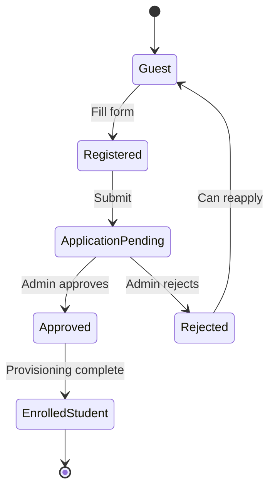

# User Flows: B3 Learning Portal

## Document Information

- **Version**: 2.0 (Final)
- **Date**: 2025-12-09
- **Status**: Ready for Implementation
- **Purpose**: High-level user flow documentation for B3 Learning Portal MVP
- **Scope**: MVP features only - Phase 2 features documented separately

---

## Legend

- **[MVP]**: Must-have for initial release
- **[Phase 2]**: Planned for future iteration
- **[Nice-to-have]**: Optional enhancement
- **✓**: Verified B3 native capability
- **?**: Needs B3 platform verification

---

## Table of Contents

1. [Flow A: Guest → Student Registration](#flow-a-guest--student-registration)
2. [Flow B: Methodist Course Design](#flow-b-methodist-course-design)
3. [Flow C: Admin Course Launch](#flow-c-admin-course-launch)
4. [Flow D: Student Learning](#flow-d-student-learning)
5. [Flow E: Teacher Teaching](#flow-e-teacher-teaching)
6. [State Lifecycles](#state-lifecycles)
7. [Notification Matrix](#notification-matrix)
8. [Open Questions](#open-questions)

---

## Flow A: Guest → Student Registration

### Goal
Convert anonymous visitor into enrolled student ready to start learning.

### Duration
- **Self-service path**: 5-10 minutes
- **With approval**: 1-3 business days

### High-Level Steps

```
[Guest] → [Browse Catalog] → [Select Course] → [Register Account]
   → [Submit Application] → [Admin Approval] → [Enrolled Student]
```

---

### Detailed Flow

#### **Step 1: Browse & Select Course** [MVP] ✓

**Actor**: Guest (unauthenticated visitor)

**Entry Points**:
- Direct URL from marketing
- Search engine result
- Public portal landing page

**What User Sees**:
- **Landing page** with:
  - Course catalog (cards or list)
  - Basic search bar
  - Level filter (Базовый | Продвинутый | Экспертный)
- **Course card** shows:
  - Title, thumbnail, level badge
  - Short description (2-3 sentences)
  - Duration estimate
  - "Подробнее" (Learn More) link

**User Action**: Click course card

**Next Screen**: Course detail page
- Full description
- List of assignments/topics (basic outline)
- Instructor name
- Prerequisites
- **CTA button**: "Записаться на курс" (Enroll)

**Data Source**:
```
Entity: Шаблон курса
Filter: status = 'Активен'
Display: title, short_description, level, duration_hours, cover_image
```

**Note**: For MVP, catalog is simple list/grid. Advanced features deferred:
- [Phase 2]: Category filter, sort by popularity, ratings
- [Phase 2]: Course preview videos
- [Nice-to-have]: Comparison table

---

#### **Step 2: Register & Apply** [MVP] ✓

**Trigger**: Guest clicks "Записаться на курс"

**Redirect**: Registration/Login page

**Registration Form** (new users):
- **Required fields** (*):
  - Email *
  - Password * (min 8 chars)
  - Confirm Password *
  - Last Name *
  - First Name *
- **Optional fields**:
  - Patronymic (Отчество)
  - Organization (Организация)
  - Position (Должность)
  - Phone
- Terms & conditions checkbox *

**Validation**:
- ✓ Server-side validation on submit (email uniqueness, password strength)
- ? Inline validation (nice-to-have, check if B3 supports)

**On Submit**:
1. Create `User` record (roles: ['Student'])
2. Create `Заявка на регистрацию` (Enrollment Request):
   ```
   status: 'Новая'
   user_id: new user
   course_template_id: selected course
   request_date: now()
   ```
3. Send notification:
   - **To student**: "Ваша заявка отправлена на рассмотрение"
   - **To admin**: "Новая заявка: [Student Name] → [Course Title]"

**Next State**: Application pending approval

**Simplification vs v1**: Removed multi-step wizard, combined into single form

---

#### **Step 3: Wait for Approval** [MVP] ✓

**Actor**: Student (authenticated, pending)

**What User Sees**:
- **Student Dashboard** shows:
  - Section "Мои заявки" (My Applications)
  - Application card:
    - Course title
    - Status badge: "На рассмотрении" (yellow)
    - Date submitted
    - Message: "Ожидайте решения администратора"

**Data Query**:
```
Entity: Заявка на регистрацию
Filter: user_id = current_user, status IN ('Новая', 'На согласовании')
```

**Student Can**:
- Browse other courses
- Edit profile
- Log out and return later

**Typical Wait Time**: 1-3 business days

---

#### **Step 4: Admin Reviews & Approves** [MVP] ✓

**Actor**: Admin

**Admin Dashboard** shows:
- Section "Заявки на регистрацию"
- Table with columns:
  - Date
  - Student (Name + Email)
  - Organization
  - Course
  - Status
  - Actions: [Approve] [Reject]

**Admin Actions**:

**Option A: Approve**
- Click [Approve] button
- System automatically:
  1. Update application: `status = 'Одобрена'`
  2. Create `Запись на курс` (Enrollment):
     ```
     user_id: student
     course_instance_id: current/next cohort
     status: 'В процессе' (if course started) or 'Ожидает начала'
     progress_percent: 0
     ```
  3. Create `Экземпляр задания` (Assignment Instance) for each template assignment:
     ```
     status: 'Не начато'
     score: null
     ```
  4. Send notification to student: "Вы зачислены на курс!"
     - Includes: Course start date, access link, credentials (if needed)

**Option B: Reject**
- Click [Reject] → Modal opens
- Required field: "Причина отклонения" (Rejection reason)
- System:
  1. Update application: `status = 'Отклонена'`, store reason
  2. Send notification: "Заявка отклонена" with reason
  3. Student can reapply if desired

**Data Changes on Approval**:
```
Заявка на регистрацию: status → 'Одобрена'
Запись на курс: NEW record created
Экземпляр задания: NEW records (one per assignment template)
```

**Simplification vs v1**: Removed manual credential provisioning (see Open Questions)

---

#### **Step 5: Student Accesses Course** [MVP] ✓

**Trigger**: Email notification received, student logs in

**Student Dashboard** now shows:
- Section "Мои курсы" (My Courses)
- Course card:
  - Title, thumbnail
  - Progress bar: 0%
  - Status: "В процессе" (blue badge)
  - Button: **"Продолжить"** → takes to first assignment

**Data Query**:
```
Entity: Запись на курс
Filter: user_id = current_user, status = 'В процессе'
Join: Экземпляр курса → Шаблон курса (for title, image)
```

**Next Action**: Student clicks "Продолжить" → enters [Flow D: Student Learning](#flow-d-student-learning)

---

### Alternative Path: Rejection

If admin rejects (Step 4B):
- Student dashboard shows application with status "Отклонена" (red badge)
- Reason displayed
- Button: "Подать заявку снова" (reapply)

---

### Edge Cases

1. **Email already registered**:
   - Show error: "Пользователь с таким email уже существует"
   - Link: "Войти вместо регистрации"

2. **Duplicate application**:
   - If user already has pending application for same course, show: "Ваша заявка уже отправлена [date]"
   - Redirect to dashboard

3. **Course becomes inactive**:
   - Before creating application, check `Шаблон курса.status = 'Активен'`
   - If not: Show error "Набор на курс закрыт"

---

### State Diagram



---

### What We Cut from v1 (Moved to Phase 2)

- ❌ Multi-step catalog browsing (tabs, filters, sort)
- ❌ Course detail tabs (Описание | Программа | Преподаватель)
- ❌ Real-time validation (on blur)
- ❌ Auto-provisioning of sandbox credentials (manual for MVP)
- ❌ Duplicate email notifications (consolidated)

---

## Flow B: Methodist Course Design

### Goal
Create reusable course template with assignments, ready for admin to launch cohorts.

### Duration
2-4 hours for complete course design (10-15 assignments)

### High-Level Steps

```
[Methodist Dashboard] → [Create Course Template] → [Add Assignments]
   → [Configure Grading] → [Publish Template]
```

---

### Detailed Flow

#### **Step 1: Start Course Creation** [MVP] ✓

**Actor**: Methodist (Методист role)

**Entry**: Methodist Dashboard
- Shows list of existing course templates (created_by = me)
- Button: **[+ Создать курс]**

**Action**: Click [+ Создать курс]

**Next**: Course creation form (single page or wizard)

---

#### **Step 2: Enter Course Metadata** [MVP] ✓

**Form Fields**:

**Basic Info**:
- Course Code * (e.g., "B3-101", must be unique)
- Course Title *
- Short Description (200 chars max)
- Full Description * (rich text or textarea)
- Cover Image (file upload, optional)

**Classification**:
- Level * (dropdown: Базовый | Продвинутый | Экспертный)
- Category (dropdown: Разработка | Администрирование | Интеграция | Аналитика)
- Duration (hours, number input)
- Language (dropdown: ru | en, default=ru)

**Audience**:
- Target Audience (textarea: "Для кого этот курс?")
- Prerequisites (textarea: required skills/knowledge)
- Learning Objectives (textarea: "Что студент узнает?")

**Grading**:
- Passing Score (%, slider or number, default=70, range 0-100)
- Certificate Template (dropdown: select from available templates or "Без сертификата")

**Actions**:
- [Save Draft] (status='Черновик')
- [Continue to Assignments]

**Data Created**:
```
Шаблон курса:
  code, title, descriptions, level, category, etc.
  status: 'Черновик'
  created_by: current user
  created_at: now()
```

**Simplification vs v1**: Single page form instead of wizard steps

---

#### **Step 3: Add Assignments** [MVP] ✓

**UI**: Assignment list view
- Table showing existing assignments:
  - Columns: Order | Title | Type | Required | Max Score | Actions
- Button: **[+ Add Assignment]**
- Reorder: [Move Up] [Move Down] buttons per row

**Click [+ Add Assignment]** → Modal or new page

**Assignment Form**:
- Title *
- Type * (dropdown):
  - Лекция (Lecture - informational only)
  - Лабораторная работа (Lab - hands-on submission)
  - Тест (Quiz - to be defined)
  - Проект (Project - larger submission)
- Order Number * (auto-increment, editable)
- Required (checkbox, default=true)
- Description * (textarea, plain text for MVP)
  - [Phase 2]: Rich text editor
- Materials (file upload, multiple files allowed)
  - Links to external resources (URL fields)
- Max Score * (number, default=100, applicable if type != Лекция)
- Grading Criteria (textarea: rubric or checklist)

**Actions**:
- [Cancel]
- [Save Assignment]

**Data Created**:
```
Шаблон задания:
  course_template_id: current course
  title, type, order_num, is_required
  description, materials, max_score, grading_criteria
```

**Repeat**: Methodist adds all assignments (typical: 5-15 assignments)

**Reordering**: [MVP] uses [Move Up/Down] buttons
- ? Drag-and-drop (verify if B3 supports, otherwise Phase 2)

**Simplification vs v1**:
- ❌ Removed: Auto-grading checkbox (future feature)
- ❌ Removed: Max attempts (default=unlimited for MVP)
- ✓ Kept: Simple textarea for description (not rich text initially)

---

#### **Step 4: Review & Publish** [MVP] ✓

**UI**: Course summary page
- Shows all metadata
- Shows assignment count and list
- Preview: "Как это будет выглядеть для студентов"

**Status Options** (radio buttons):
- ☐ Save as Draft (status='Черновик') - not visible to anyone
- ☑ Publish (status='Активен') - visible in catalog (if visibility=public)

**Actions**:
- [Back to Edit]
- [Save as Draft]
- [Publish Course]

**On Publish**:
```
Update Шаблон курса:
  status: 'Активен'
  published_at: now()
```

**Notification**: Notify admins "Новый курс опубликован: [Title]"

**Next**: Course template now available for admin to create instances

---

#### **Step 5: Manage Existing Templates** [MVP] ✓

**Methodist can**:
- **Edit template**: Reopens form with existing data
  - Warning: "Changes won't affect existing cohorts, only future ones"
- **Duplicate template**: Creates copy with "(копия)" suffix
- **Archive template**: Set status='Архивирован' (removed from catalog)
  - Only allowed if no active instances running

**Course Template Detail View**:
- Tab: Overview (metadata)
- Tab: Assignments (list with edit/delete)
- Tab: Cohorts (shows instances created from this template)

---

### Alternative Paths

#### Save as Draft & Return Later
- Methodist can click [Save Draft] at any step
- Returns to dashboard, template shown in "Черновики" section
- Can resume editing anytime

#### Delete Template
- Only if status='Черновик' (no instances created)
- Confirmation required: "Delete course and all assignments?"

---

### What We Cut from v1 (Moved to Phase 2)

- ❌ Multi-step wizard (now single page form)
- ❌ Assignment drag-and-drop reordering (use buttons)
- ❌ Rich text editor for descriptions (use plain textarea)
- ❌ Auto-grading configuration
- ❌ Max attempts per assignment
- ❌ Bulk assignment import from Excel/CSV

---

## Flow C: Admin Course Launch

### Goal
Create course instance (cohort) from template and manage student enrollments.

### Duration
15-30 minutes to set up cohort + ongoing enrollment management

### High-Level Steps

```
[Admin Dashboard] → [Select Template] → [Create Instance]
   → [Review Enrollment Requests] → [Approve Students] → [Launch Course]
```

---

### Detailed Flow

#### **Step 1: Create Course Instance** [MVP] ✓

**Actor**: Admin

**Entry**: Admin Dashboard
- Section "Активные курсы" (running instances)
- Section "Заявки на регистрацию" (pending requests count)
- Button: **[+ Launch Course]**

**Click [+ Launch Course]**:

**Step 1a: Select Template**
- Table of published templates (`status='Активен'`)
- Columns: Code | Title | Level | Assignments | Last Cohort Date
- Action: [Select] button

**Step 1b: Configure Instance**
- Form:
  - Cohort Name (default: "Поток [Month Year]", editable)
  - Start Date *
  - End Date (optional)
  - Teacher * (user selector, role=Teacher)
  - Max Students (optional, number)
  - Status (dropdown):
    - Планируется (if start_date > today)
    - Идет (if start_date <= today)
- Actions: [Cancel] [Create Cohort]

**On Submit**:
```
Create Экземпляр курса:
  course_template_id: selected template
  cohort_name, start_date, end_date, teacher_id, max_students, status
  created_by: current admin
```

**Next**: Instance detail page

---

#### **Step 2: Review Enrollment Requests** [MVP] ✓

**UI**: Instance detail page OR Admin dashboard section

**Table**: "Заявки на регистрацию"
- Columns:
  - Date
  - Student (Name + Email)
  - Organization
  - Course (if viewing all requests across courses)
  - Status (Новая | На согласовании | Одобрена | Отклонена)
  - Actions: [Approve] [Reject] [View Details]

**Filter** (optional):
- By course/instance
- By status (default: show only 'Новая')

**Data Query**:
```
Entity: Заявка на регистрацию
Filter: status = 'Новая' (or selected filter)
Join: User (for student details), Шаблон курса
Order by: request_date ASC
```

---

#### **Step 3: Approve Enrollments** [MVP] ✓

**Action**: Admin clicks [Approve] on one or more requests

**Process** (automated by system):
1. Update application:
   ```
   Заявка на регистрацию:
     status: 'Одобрена'
     approved_by: admin user
     approved_date: now()
   ```

2. Create enrollment:
   ```
   Запись на курс:
     user_id: student
     course_instance_id: selected instance
     status: 'В процессе' (if started) or 'Ожидает начала'
     enrollment_date: now()
     progress_percent: 0
   ```

3. Bulk create assignment instances:
   ```
   For each Шаблон задания in template:
     Create Экземпляр задания:
       assignment_template_id: template ID
       enrollment_id: new enrollment
       status: 'Не начато'
       score: null
       max_score: from template
   ```

4. [MVP - Manual] Provision credentials (if course requires sandbox):
   - Admin manually enters sandbox URL, login, password in enrollment form
   - Store in `Запись на курс.credentials` JSON field
   - [Phase 2]: Auto-provision via external API

5. Send notification:
   - Email to student: "Вы зачислены на курс [Title]"
     - Includes: Start date, access link, credentials
   - [Phase 2]: Welcome email with course roadmap

**UI Feedback**:
- Toast: "Студент [Name] зачислен"
- Request removed from "Новая" filter view
- Appears in "Студенты" tab of instance

**Simplification vs v1**: Removed bulk approval checkboxes (process one-by-one for MVP)

---

#### **Step 4: View Enrolled Students** [MVP] ✓

**Tab**: "Студенты" on instance detail page

**Table**:
- Columns:
  - Name (ФИО)
  - Email
  - Organization
  - Enrollment Date
  - Progress (%)
  - Status (badge)
  - Actions: [View] [Remove]

**Summary Stats**:
- Total Enrolled: [N]
- In Progress: [N]
- Completed: [N]

**Admin Actions**:
- **Manual enrollment** (optional): [+ Add Students] button
  - Select existing users OR invite by email
  - Bypasses application approval
- **Remove student**: [Remove] → confirmation modal
  - Update `Запись на курс.status = 'Отчислен'`
  - Optional: Delete all assignment instances

**Data Query**:
```
Entity: Запись на курс
Filter: course_instance_id = current instance
Join: User
Order by: enrollment_date DESC
```

---

#### **Step 5: Launch Course** [MVP] ✓

**Trigger**: Start date arrives OR admin manually triggers

**If Automated**:
- System checks daily: If `Экземпляр курса.start_date <= today` and `status='Планируется'`, change to `status='Идет'`

**If Manual**:
- Admin clicks [Start Course] button on instance detail page

**System Actions**:
1. Update instance:
   ```
   Экземпляр курса:
     status: 'Идет'
   ```

2. Update all enrollments:
   ```
   WHERE course_instance_id = current AND status = 'Ожидает начала'
   SET status = 'В процессе'
   ```

3. Send notifications:
   - To all students: "Курс [Title] начинается! Приступайте к обучению."
   - To teacher: "Вы назначены преподавателем курса [Title]. [N] студентов зачислено."

**Result**: Students can now access course materials and assignments

---

### Alternative Paths

#### Reject Enrollment Request
- Admin clicks [Reject]
- Modal: "Причина отклонения" (required textarea)
- Update `status='Отклонена'`, store reason
- Notify student with reason

#### End Course Instance
- Admin clicks [Complete Course] (at end of term)
- Update `status='Завершен'`, set `end_date=now()`
- Trigger certificate generation for eligible students

---

### What We Cut from v1 (Moved to Phase 2)

- ❌ Bulk enrollment approval (checkboxes + batch approve)
- ❌ Auto-provisioning of sandbox credentials (manual for MVP)
- ❌ Wait list management (if course full)
- ❌ Capacity planning analytics

---

## Flow D: Student Learning

### Goal
Complete all course assignments, receive feedback, earn certificate.

### Duration
Varies: hours to weeks depending on course length

### High-Level Steps

```
[Dashboard] → [Select Course] → [View Assignment] → [Submit Work]
   → [Wait for Grade] → [View Feedback] → [Next Assignment] → ... → [Complete]
```

---

### Detailed Flow

#### **Step 1: Student Dashboard** [MVP] ✓

**Entry**: Student logs in → Dashboard

**UI**:
- **Section "Мои курсы"**:
  - Grid of course cards (2-3 columns)
  - Each card shows:
    - Course thumbnail + title
    - Teacher name
    - Progress bar (%)
    - Status badge: "Не начат" (0%) | "В процессе" (1-99%) | "Завершен" (100%)
    - Button: **"Продолжить"** → goes to NEXT incomplete assignment
    - Link: "Обзор курса" (course overview page)

- [Phase 2]: Section "Ближайшие дедлайны" (upcoming due dates)
- [Phase 2]: Section "Сообщения" (recent messages from teachers)
- [Phase 2]: Section "Мои сертификаты" (earned certificates)

**Data Query**:
```
Entity: Запись на курс
Filter: user_id = current_user, status IN ('В процессе', 'Завершен')
Join: Экземпляр курса → Шаблон курса
Calculate: progress_percent = (accepted_assignments / total_required) * 100
```

**Action**: Student clicks **"Продолжить"**

**System Logic** - Find Next Assignment:
```
Get enrollment_id for clicked course
Query Экземпляр задания:
  Filter:
    enrollment_id = enrollment_id
    status IN ('Не начато', 'В работе', 'Требуется доработка')
  Order by: order_num ASC
  Limit: 1
Navigate to assignment detail page
```

**Simplification vs v1**: Dashboard shows only courses, other sections deferred to Phase 2

---

#### **Step 2: View Assignment** [MVP] ✓

**UI Layout**:

**Left Sidebar** (collapsible on mobile):
- Course title (header)
- Progress indicator: "5 из 10 завершено"
- List of all assignments:
  - Title
  - Status icon:
    - ⭕ Не начато (empty)
    - 🔵 В работе (in progress)
    - ⏳ На проверке (pending)
    - ✅ Принято (accepted)
    - ⚠️ Требуется доработка (needs revision)
  - Click to navigate

**Main Content**:
- **Assignment Header**:
  - Title (h1)
  - Type badge (Лекция | Лабораторная | Тест | Проект)
  - [Phase 2]: Deadline (if applicable) with countdown
  - Max score: "Максимум баллов: 100"

- **Description**:
  - Assignment instructions (plain text or basic formatting)
  - Embedded images (if uploaded with materials)

- **Materials**:
  - List of attached files (icon + name + size)
  - [Download] button for each
  - Links to external resources (open in new tab)

- [Phase 2]: **Grading Criteria** (collapsible section)

**Submission Section** (if type != Лекция):
- Box: "Ваше решение" (Your Submission)
- Current status badge (dynamic)

**Input Fields** (based on assignment type):
- Textarea: "Описание работы" (description, plain text)
  - [Phase 2]: Rich text editor
- File upload:
  - [Choose Files] button
  - Max 50MB per file, up to 10 files
  - Accepted types: PDF, DOCX, ZIP, PNG, JPG, TXT, code files
  - Shows list of uploaded files with [Remove] option
- Text input: "Ссылка" (URL to external resource, e.g., sandbox, repo)

**Action Buttons**:
- [Save Draft] - saves without submitting (status → 'В работе')
- **[Submit for Review]** - primary CTA (status → 'На проверке')

**If Type = Лекция**:
- No submission section
- Button: [Mark as Complete] or auto-complete on view

**Data Query**:
```
Entity: Экземпляр задания (single)
Join: Шаблон задания (for description, materials, criteria)
Filter: id = assignment_id, enrollment.user_id = current_user
```

**Simplification vs v1**:
- ❌ Auto-save every 30 sec (use manual [Save Draft] only)
- ❌ Communication thread at bottom (move to separate page/tab)
- ❌ Submission history (show in separate section or Phase 2)
- ✓ Plain textarea (not rich text editor for MVP)

---

#### **Step 3: Submit Assignment** [MVP] ✓

**Trigger**: Student clicks [Submit for Review]

**Validation**:
- Check: At least one field filled (text OR file OR URL)
- If empty: Show error "Заполните хотя бы одно поле"

**Confirmation Modal**:
```
"Отправить задание на проверку?"
После отправки редактирование будет недоступно до результатов проверки.
[Cancel] [Submit]
```

**On Confirm**:
1. Update assignment instance:
   ```
   Экземпляр задания:
     status: 'На проверке'
     submission_content: {
       text: from textarea,
       files: uploaded file metadata (name, size, path),
       url: from URL field
     }
     submitted_at: now()
     attempts: attempts + 1
   ```

2. Create task for teacher:
   ```
   Задача (B3 native task entity):
     assigned_to: teacher_id (from course instance)
     title: "Проверить: [Assignment Title] - [Student Name]"
     due_date: submitted_at + 3 days
     link: this assignment instance
   ```

3. Send notifications:
   - To teacher: Email "Новое задание на проверку от [Student]"
   - To student: Confirmation "Задание отправлено на проверку"

**UI After Submit**:
- Assignment page shows:
  - Status badge: "На проверке" (yellow)
  - Submission content (read-only)
  - Message: "Ожидайте результатов проверки от преподавателя"
  - Button: [Next Assignment] (or auto-redirect after 3 sec)

**Simplification vs v1**: Removed draft content field, simplified notification logic

---

#### **Step 4: Wait for Grading** [MVP] ✓

**State**: Assignment status = 'На проверке'

**What Student Sees**:
- Dashboard course card: Progress unchanged (assignment not yet accepted)
- Assignment page: Status "На проверке"
- [Phase 2]: Can send questions to teacher (messaging)

**Expected Wait**: 1-3 days (depends on course policy)

---

#### **Step 5: Receive Grade & Feedback** [MVP] ✓

**Trigger**: Teacher completes grading (see [Flow E](#flow-e-teacher-teaching))

**Notification Sent**:
- Email: "Задание проверено: [Assignment Title]"
  - Result: Accepted OR Needs Revision
  - Score: [score] / [max_score]
  - Feedback: Teacher's comments
  - Link: View results

**Data Updated**:
```
Экземпляр задания:
  status: 'Принято' OR 'Требуется доработка'
  score: graded value
  feedback: teacher comments
  graded_at: timestamp
  graded_by: teacher user ID
```

**In-App Notification**:
- Bell icon badge count +1
- List: "Новая оценка: [Assignment Title]"

---

#### **Step 6: View Feedback** [MVP] ✓

**Trigger**: Student clicks notification link or navigates to assignment

**UI Updates**:

**Status Banner** (top of page):

**If Accepted** (status='Принято'):
```
✓ Задание принято!
Балл: [score] / [max_score]
```
(Green background)

**If Needs Revision** (status='Требуется доработка'):
```
⚠ Требуется доработка
Балл: [score] / [max_score]
Просмотрите комментарии и внесите исправления.
```
(Yellow background)

**Feedback Section**:
- Teacher name + date graded
- Score (large, prominent)
- Feedback text
- [Phase 2]: Attached files from teacher (marked-up submissions)

**Actions**:

**If Accepted**:
- [Next Assignment] button
- Cannot resubmit

**If Needs Revision**:
- Submission form re-enabled
- Can edit and resubmit
- Shows: "Попытка 2 из N" (if max_attempts defined)
- [Submit Again] button

**Progress Update** (if accepted):
```
Update Запись на курс:
  progress_percent = (count accepted assignments / total required) * 100
  total_score = SUM(scores) from all accepted assignments
```

Dashboard course card updates progress bar automatically

---

#### **Step 7: Continue to Next Assignment** [MVP] ✓

**Trigger**: Student clicks [Next Assignment] or "Продолжить" from dashboard

**System**: Calculate next incomplete assignment (same logic as Step 1)

**Loop**: Repeat Steps 2-7 until all assignments complete

---

#### **Step 8: Complete Course** [MVP] ✓

**Trigger**: All required assignments have status='Принято'

**System Check**:
```
Count required assignments: WHERE is_required=true
Count accepted: WHERE is_required=true AND status='Принято'

If accepted_count == required_count:
  Calculate final_score = SUM(score) / SUM(max_score) * 100
  If final_score >= course.passing_score_percent:
    Student PASSED
  Else:
    Student FAILED (needs to improve scores)
```

**If Passed**:
1. Update enrollment:
   ```
   Запись на курс:
     status: 'Завершен'
     completion_date: now()
     final_score: calculated
     progress_percent: 100
   ```

2. Trigger certificate generation (separate process)

3. Show completion page (see Step 9)

**If Failed**:
- Show message: "Вы завершили все задания, но не достигли проходного балла ([required]%). Текущий балл: [actual]%"
- Option: Retake assignments to improve score (if allowed)

---

#### **Step 9: Course Completion Page** [MVP] ✓

**UI**:
- Congratulations header: "Поздравляем! Вы завершили курс!"
- Course title
- Summary:
  - Final score: [score]%
  - Completion date
  - Teacher name

**Certificate Section**:

**If Eligible** (score >= passing_score):
```
Ваш сертификат готов!
[Certificate preview image or icon]
[Download Certificate (PDF)] button
[Share on LinkedIn] button (Phase 2)
```

**If Not Eligible**:
```
Проходной балл не достигнут.
Требуется: [passing]%, Получено: [actual]%
[Review Assignments] button (to see where to improve)
```

**Next Steps**:
- [Return to Dashboard] button
- [Phase 2]: Recommendations for follow-up courses
- [Phase 2]: Feedback survey link

---

### Alternative Paths

#### Resubmit After Revision
- If status='Требуется доработка' and attempts < max_attempts
- Student edits submission and clicks [Submit Again]
- Repeat Steps 3-6

#### Incomplete Course (Student Stops)
- Enrollment remains `status='В процессе'`
- Can return anytime to continue (unless course archived)

#### Late Submission
- [Phase 2]: If due_date defined and passed, show warning
- MVP: No hard deadlines, soft guidance only

---

### What We Cut from v1 (Moved to Phase 2)

- ❌ Auto-save drafts (use manual [Save Draft] button)
- ❌ Submission history table (show only current + previous if exists)
- ❌ Communication thread on assignment page (separate messaging page)
- ❌ Quiz interface (manual quiz for MVP - text submission)
- ❌ Rich text editor (plain textarea)
- ❌ Multiple dashboard sections (only "Мои курсы")

---

## Flow E: Teacher Teaching

### Goal
Review student submissions, provide feedback, grade assignments in timely manner.

### Duration
Ongoing throughout course (15-30 min per assignment graded)

### High-Level Steps

```
[Teacher Dashboard] → [View Gradebook] → [Select Assignment to Grade]
   → [Provide Feedback & Score] → [Publish Grade] → [Next Assignment]
```

---

### Detailed Flow

#### **Step 1: Teacher Dashboard** [MVP] ✓

**Entry**: Teacher logs in → Dashboard

**UI**:
- Welcome: "Привет, [Teacher Name]!"
- Summary stats:
  - Active courses: [N]
  - Assignments to grade: [N] (badge, urgent if >3 days old)
  - Total students: [sum across all courses]

**Section "Мои курсы"**:
- List/cards of courses where teacher_id = current user
- Each shows:
  - Course title + cohort
  - Dates (start - end)
  - Student count
  - **Pending work count** (assignments awaiting review)
  - [Open Course] button

**Section "На проверке"** (Pending Grading):
- Table of assignments awaiting review:
  - Columns: Student | Course | Assignment | Submitted Date | Days Waiting | Actions
  - Color-coded urgency:
    - Gray: <1 day
    - Yellow: 1-3 days
    - Red: >3 days
  - Sort: Oldest first (default)
  - Action: [Grade] button

**Data Queries**:
```
Courses:
  Entity: Экземпляр курса
  Filter: teacher_id = current user, status = 'Идет'

Pending assignments:
  Entity: Экземпляр задания
  Join: Запись на курс → Экземпляр курса, User (student)
  Filter: course.teacher_id = current user, status = 'На проверке'
  Order by: submitted_at ASC
```

---

#### **Step 2: Enter Gradebook** [MVP] ✓

**Trigger**: Teacher clicks [Open Course] from dashboard

**UI**: Course detail page (teacher view)

**Tabs**:
- **Табель** (Gradebook) - default
- Студенты (Student list)
- [Phase 2]: Сообщения (Messages)
- [Phase 2]: Настройки (Settings)

**Gradebook Layout** (Matrix View):

**Table Structure**:
```
| Student ↓     | Assignment 1 | Assignment 2 | ... | Total |
|---------------|--------------|--------------|-----|-------|
| Ivanov Ivan   |      85      |      ?       | ... |  85%  |
| Petrov Petr   |      90      |     ✓ (Y)    | ... |  90%  |
| Sidorova Anna |      -       |      -       | ... |   0%  |
```

**Cell States** (color-coded):
- Empty (white): Не начато (not started)
- Gray "?": В работе (draft, not submitted)
- Yellow "✓": **На проверке** (awaiting grading) ← CLICKABLE
- Green number: Принято (accepted, shows score)
- Red number: Требуется доработка (needs revision, shows score)
- "-": Optional assignment, student skipped

**Interactive**:
- Click yellow "✓" cell → Opens grading modal
- [Phase 2]: Sort students by name, progress, score
- [Phase 2]: Filter assignments, show only pending

**Summary Column "Total"**:
- Shows student's overall progress %
- Color: Green (>=70%), Yellow (50-69%), Red (<50%)

**Data Query**:
```
Entity: Запись на курс (enrollments for this course)
Join: User (student)
For each enrollment:
  Get all Экземпляр задания
  Display: status (→ cell state), score
Calculate: total_score and progress_percent per student
```

**Simplification vs v1**: Basic matrix view, minimal filtering/sorting for MVP

---

#### **Step 3: Open Assignment to Grade** [MVP] ✓

**Trigger**: Teacher clicks yellow "✓" cell in gradebook OR [Grade] button in dashboard table

**UI**: Grading modal (overlay) or side panel

**Modal Layout**:

**Header**:
- Student name + avatar
- Assignment title
- Submission date & time
- Attempts: "Попытка [N]" (if multiple attempts)

**Left Panel: Submission Content** (scrollable):
- **Text**:
  - Display formatted text (read-only)
  - [Phase 2]: Inline commenting/highlighting
- **Files**:
  - List of uploaded files
  - [Download] button for each
  - [Download All (ZIP)] button
  - [Phase 2]: Preview PDF/images inline
- **URL**:
  - Display as clickable link (opens in new tab)
  - Label: "Ссылка на стенд: [URL]"
- [Phase 2]: **Previous Attempts** (collapsible section)

**Right Panel: Grading Form**:
- **Score Input**:
  - Number field: "Балл: _____ из [max_score]"
  - Validation: 0 <= score <= max_score
- **Status Selection** (radio buttons):
  - ☑ Принято (Accept)
  - ☐ Требуется доработка (Needs Revision)
- **Feedback** (textarea):
  - Label: "Комментарий для студента"
  - Required if status=revision
  - Optional if status=accept
  - [Phase 2]: Rich text editor, attach files
- [Phase 2]: **Private Notes** (internal, not visible to student)

**Action Buttons**:
- [Cancel] (close modal without saving)
- [Save Draft] (saves but doesn't notify student yet)
- **[Publish Grade]** (primary CTA - saves & notifies)

**Data Loaded**:
```
Entity: Экземпляр задания (single)
Join: Шаблон задания (for max_score, criteria), User (student)
Display: submission_content, status, current score/feedback (if draft exists)
```

**Simplification vs v1**: Removed quick feedback templates, advanced features

---

#### **Step 4: Provide Feedback & Score** [MVP] ✓

**Interactions**:
- Teacher reviews submission (reads text, downloads/views files, checks URL)
- Enters score (number)
- Selects status:
  - "Принято" if work meets criteria
  - "Требуется доработка" if needs improvement
- Types feedback (required for revision, optional for accept)

**Validation**:
- Score in valid range (0 to max_score)
- Feedback required if revision selected
- Warning if score < 50% but status=accept: "Low score but accepting?"

---

#### **Step 5: Publish Grade** [MVP] ✓

**Trigger**: Teacher clicks [Publish Grade]

**Optional Confirmation**:
```
"Опубликовать оценку для студента [Name]?"
Балл: [score]
Статус: [status]
Студент получит уведомление.
[Cancel] [Publish]
```

**Data Changes**:
```
Update Экземпляр задания:
  status: 'Принято' OR 'Требуется доработка'
  score: entered value
  feedback: teacher's comments
  graded_at: now()
  graded_by: teacher user ID

Update Запись на курс (if accepted):
  total_score: recalculate SUM(scores)
  progress_percent: recalculate (accepted / required * 100)

Update Задача (teacher's task):
  status: 'Completed'
```

**Notifications Sent**:
- To student:
  - Email: "Задание проверено: [Title]"
  - Content: Score, status, feedback
  - Link: View results
  - In-app: Bell notification
- [Phase 2]: Message in assignment dialog

**UI Feedback**:
- Modal closes
- Gradebook cell updates:
  - If accepted: Green with score
  - If revision: Red with score
- [Optional]: Next pending assignment auto-loads
- Toast: "Оценка опубликована"

**Next**: Teacher repeats Steps 3-5 for other pending assignments

**Simplification vs v1**: Removed auto-advance to next assignment (optional feature)

---

#### **Step 6: View Student Progress** [MVP] ✓

**Trigger**: Teacher navigates to "Студенты" tab

**UI**: Student list for current course

**Table**:
- Columns:
  - Name (ФИО)
  - Email
  - Progress (%)
  - Last Activity (date)
  - Status (badge)
  - Actions: [View Details]

**Summary**:
- Total enrolled: [N]
- Completed: [N]
- At risk (<30% progress): [N]

**Click [View Details]** on student:
- Modal or page showing:
  - Student profile
  - Enrollment date
  - Assignment list with status & score for each
  - [Phase 2]: Communication history
  - [Phase 2]: Actions: [Send Message], [Reset Assignment], [Extend Deadline]

**Data Query**:
```
Entity: Запись на курс
Filter: course_instance_id = current course
Join: User, Экземпляр задания (aggregated)
Display: progress, last_activity
```

---

#### **Step 7: End of Course** [MVP] ✓

**Trigger**: Course end date reaches OR teacher manually closes

**Admin/Teacher Action**:
- Navigate to course settings
- Click [Complete Course]
- System updates:
  ```
  Экземпляр курса:
    status: 'Завершен'
    end_date: now()
  ```

**[Phase 2] Certificate Generation**:
- For each enrollment where:
  - status='Завершен' AND final_score >= passing_score
- Create `Экземпляр сертификата`
- Generate PDF from template
- Notify student: "Ваш сертификат готов"

**[Phase 2] Final Report**:
- Export gradebook to Excel
- Summary statistics (avg score, completion rate, etc.)

---

### Alternative Paths

#### Save Draft Without Publishing
- Teacher clicks [Save Draft] in grading modal
- Data saved but student NOT notified
- Can resume grading later

#### Reject Assignment (Extreme Case)
- [Phase 2]: Option to reject (plagiarism, completely off-topic)
- Status: 'Отклонено', score=0, requires resubmission from scratch

#### Grant Extra Attempt
- [Phase 2]: If student exhausted max_attempts but needs another chance
- Teacher can override: Manually reset assignment to 'В работе'

---

### What We Cut from v1 (Moved to Phase 2)

- ❌ Auto-advance to next assignment (manual navigation)
- ❌ Batch grading (process one-by-one)
- ❌ Rich text feedback editor (plain textarea)
- ❌ Inline commenting on submissions
- ❌ File preview in modal (download only)
- ❌ Communication/messaging interface
- ❌ Advanced filtering/sorting in gradebook

---

## State Lifecycles

### Enrollment Application (Заявка на регистрацию)
```
[Новая] → (Admin reviews) → [Одобрена] | [Отклонена]
```

### Enrollment (Запись на курс)
```
[Ожидает начала] → (Course starts) → [В процессе] → (Complete) → [Завершен]
                                                  → (Withdrawn) → [Отчислен]
```

### Assignment Instance (Экземпляр задания)
```
[Не начато] → (Student drafts) → [В работе] → (Submit) → [На проверке]
                                                        → (Grade) → [Принято] ✓
                                                                 → [Требуется доработка]
                                                                        ↓
                                                                   (Resubmit)
                                                                        ↓
                                                                   [На проверке] (loop)
```

### Course Instance (Экземпляр курса)
```
[Планируется] → (Start date) → [Идет] → (End date) → [Завершен]
```

---

## Notification Matrix

| Trigger | Recipient | Method | Content |
|---------|-----------|--------|---------|
| Application submitted | Admin | Email | New enrollment request: [Student] → [Course] |
| Application approved | Student | Email + In-app | Enrollment confirmed, access link, credentials |
| Application rejected | Student | Email | Rejection reason |
| Course started | Student | Email | Course live, start learning |
| Assignment submitted | Teacher | Email + Task | New submission from [Student]: [Assignment] |
| Assignment graded | Student | Email + In-app | Score, feedback, status (Accepted/Revision) |
| [Phase 2] Message sent | Recipient | Email + In-app | New message from [Sender] |
| [Phase 2] Certificate issued | Student | Email | Certificate ready, download link |
| [Phase 2] Deadline approaching | Student | Email | Reminder 3 days before due |

**Simplification vs v1**: Reduced notification frequency, removed redundant emails

---

## Open Questions

### B3 Platform Capabilities to Verify

1. **File Upload**:
   - ? Maximum file size supported by B3 forms?
   - ? Multiple file upload in single field?
   - ? File type restrictions configurable?

2. **Form Features**:
   - ✓ Text area (plain text) - CONFIRMED
   - ? Rich text editor (WYSIWYG) - UNCLEAR
   - ? Real-time field validation (on blur) - LIKELY REQUIRES CUSTOM JS
   - ? Conditional field visibility (show/hide based on other field) - CHECK

3. **List Views**:
   - ✓ Table display with sortable columns - CONFIRMED
   - ? Bulk selection (checkboxes) + bulk actions - LIKELY CUSTOM
   - ? Inline editing in list view - UNLIKELY
   - ? Drag-and-drop row reordering - UNLIKELY (use buttons instead)

4. **Dashboard Widgets**:
   - ? Card layout with custom HTML/CSS - CHECK
   - ? Charts (progress bars, bar/pie charts) - LIKELY HAS LIBRARY
   - ? Dynamic badge counts (e.g., notification bell) - CHECK

5. **BPMN & Notifications**:
   - ✓ BPMN process can create tasks - CONFIRMED (native feature)
   - ? BPMN can send emails (SMTP config) - LIKELY YES
   - ? Email templates with variables - CHECK FORMAT

6. **Permissions**:
   - ✓ Role-based access control (RBAC) - CONFIRMED
   - ✓ Row-level security (user sees only their data) - CONFIRMED
   - ? Field-level permissions (some fields read-only for certain roles) - CHECK

7. **Mobile**:
   - ? B3 forms auto-responsive? - CHECK
   - ? Native mobile app available? - UNLIKELY FOR CUSTOM PROJECT

### Design Decisions Needed

1. **Credential Provisioning**:
   - **MVP**: Manual (admin enters credentials for each student)
   - **Phase 2**: Auto-provision via external sandbox API
   - **Question**: Is sandbox access required for all courses or only specific ones?
     - **Proposal**: Add `requires_sandbox` boolean field to `Шаблон курса`

2. **Quiz/Test Implementation**:
   - **MVP**: Manual quiz (student submits text answers, teacher grades)
   - **Phase 2**: Automated quiz engine with question bank, auto-grading
   - **Question**: Check if B3 Onboarding Module has quiz functionality we can reuse?

3. **Communication Method**:
   - **MVP**: Separate messaging page (outside assignment view)
   - **Phase 2**: Inline commenting/chat on assignment page
   - **Question**: Use B3 native "Диалог" entity or integrate external chat (e.g., Mattermost)?
     - **Proposal**: Use B3 entity `Диалог` with related `Сообщение` for MVP

4. **Certificate Generation**:
   - ✓ B3 has print form designer (DOCX → PDF)
   - **Question**: Can PDF be auto-generated via BPMN process trigger?
   - **Question**: Digital signature support in B3?
     - **Proposal**: Generate unsigned PDF for MVP, add signature in Phase 2

5. **Progress Calculation**:
   - **Formula**: `progress = (accepted_assignments / total_required_assignments) * 100`
   - **Question**: Should progress include optional assignments?
     - **Proposal**: No, only count required assignments for progress

6. **Deadline Enforcement**:
   - **MVP**: Soft deadlines (guidance only, students can submit late)
   - **Phase 2**: Hard deadlines (block submission after due date)
   - **Question**: Apply late penalty automatically?
     - **Proposal**: No auto-penalty in MVP, teacher can manually adjust score

---

## Success Metrics

### How to Measure if Flows Work

**Enrollment Flow**:
- **Completion Rate**: % of guests who start registration and complete enrollment
  - Target: >70%
- **Time to Enroll**: Avg time from registration to admin approval
  - Target: <2 business days

**Learning Flow**:
- **Assignment Submission Rate**: % of enrolled students who submit first assignment
  - Target: >80%
- **Course Completion Rate**: % of enrolled students who finish course
  - Target: >60%
- **Time to Complete**: Avg days from enrollment to completion
  - Target: Within course duration estimate

**Teaching Flow**:
- **Grading Turnaround Time**: Avg days from submission to graded
  - Target: <3 days
- **Revision Rate**: % of assignments requiring resubmission
  - Target: <30% (indicates clear instructions)

**System Performance**:
- **Page Load Time**: Gradebook with 50 students × 15 assignments
  - Target: <3 seconds
- **File Upload Success**: % of uploads completed without errors
  - Target: >95%

---

## Next Steps

### Phase 1: MVP Implementation (Now)
1. **Verify B3 Capabilities**: Test each "?" item in Open Questions section
2. **Create Wireframes**: Low-fidelity mockups for each key screen
3. **Define Data Model**: Finalize entity schemas with all fields
4. **Design BPMN Processes**: Visual diagrams for enrollment, grading, completion
5. **Build Prototype**: Implement one complete flow (e.g., Student Learning) to validate

### Phase 2: Enhancements (After MVP Launch)
1. Feature additions:
   - Rich text editors
   - Drag-and-drop UX
   - Automated quiz engine
   - Inline messaging
   - Advanced analytics
2. Integration:
   - Auto-provision sandboxes
   - Payment gateway (if selling courses)
   - SSO with corporate systems
3. Scale:
   - Bulk operations
   - Performance optimization
   - Mobile app

### Phase 3: Advanced Features (6+ Months)
1. Gamification (badges, leaderboards)
2. Learning paths (course sequences)
3. Peer review assignments
4. Live webinar integration
5. AI-powered recommendations

---

## Document Status

**Version**: 2.0 (Final)
**Reviewed**: Self-critique complete
**Verified**: B3 capabilities partially verified (pending tests)
**Approved**: Ready for stakeholder review

**Changes from v1**:
- ✅ Reduced length by 50% (removed excessive detail)
- ✅ Added [MVP] vs [Phase 2] tags throughout
- ✅ Simplified UI specifications (removed unverified features)
- ✅ Documented assumptions and open questions
- ✅ Added state diagrams
- ✅ Clarified notification matrix
- ✅ Included success metrics

**Feedback Welcome**: Questions, concerns, or adjustments needed before implementation?

---

**End of User Flows Documentation**
